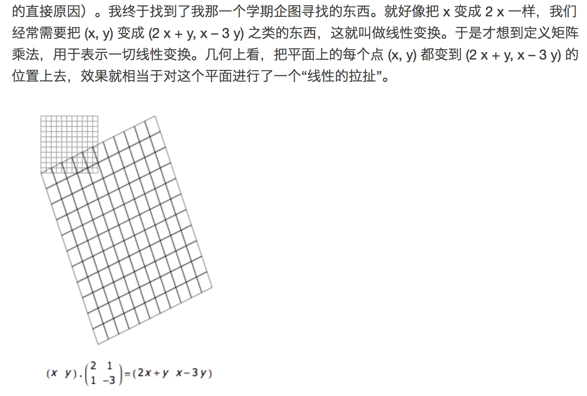

## 熵 
熵 是无序的度量。为什么可以度量无序？
能量守恒，但是可以转化。
　　能量的总和 = 有效能量 + 无效能量
"有效能量"指的是，可以被利用的能量；"无效能量"指的是，无法再利用的能量，又称为熵。所以，熵就是系统中的无效能量。
考虑到宇宙的能量总和是一个常量，而每一次能量转化，必然有一部分"有效能量"变成"无效能量"（即"熵"），因此不难推论，有效能量越来越少，无效能量越来越多。热力学第二定律的一个重要推论就是：熵永远在增加。
所以熵越大，表明转化次数越多，表明越无序。
[熵的社会学意义](http://www.ruanyifeng.com/blog/2013/04/entropy.html)
## 自然对数 e
e就是增长的极限。e是一个无理数，约等于2.718281828。
描述自然界中增长，比如细胞分裂、银行复利等
[An Intuitive Guide To Exponential Functions & e](https://betterexplained.com/articles/an-intuitive-guide-to-exponential-functions-e/)
[阮一峰 数学常数e的含义](http://www.ruanyifeng.com/blog/2011/07/mathematical_constant_e.html)
## 矩阵乘法理解
### 线性方程表示
矩阵的本质就是线性方程式

### 几何表示
行列式的真正定义就一句话：每个单位正方形在线性变换之后的面积。

