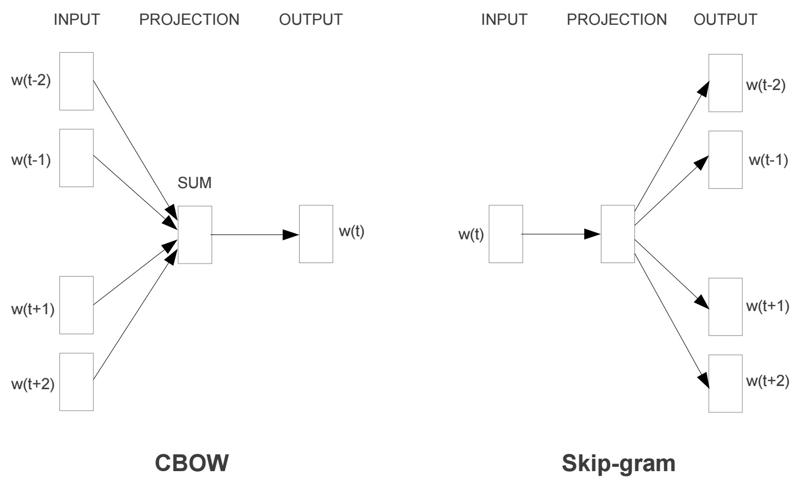
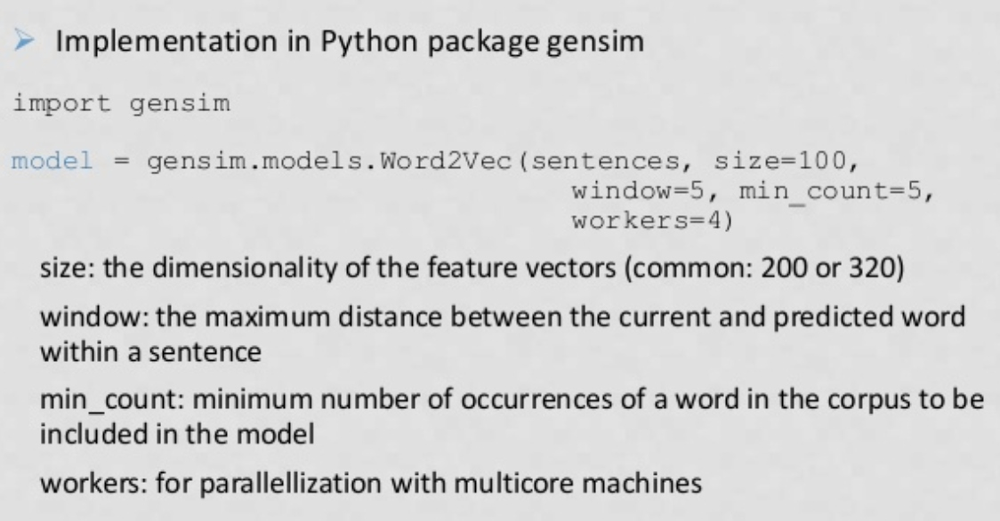
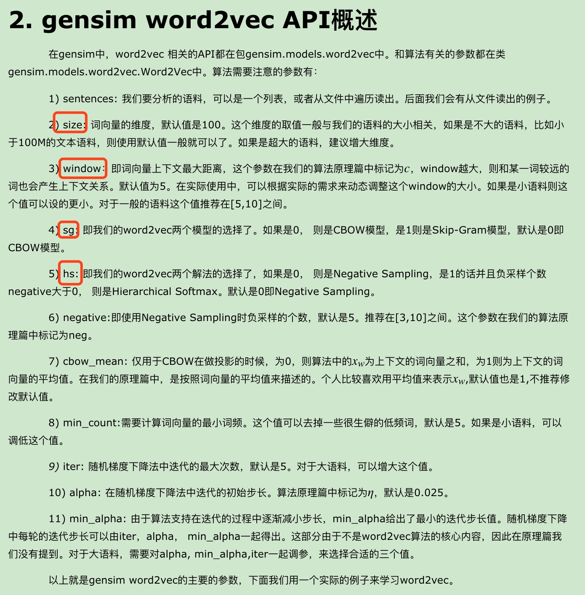
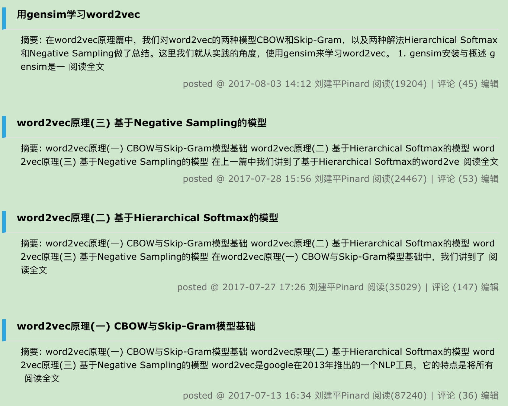
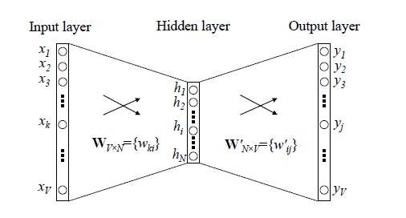
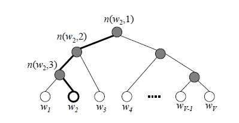

## 基本思想
CBOW （Continuous Bag Of Word）
Skip-gram

## Word2Vec


### 系列
[刘建平 Word2Vec系列超级棒](https://www.cnblogs.com/pinard/category/894695.html)

### 问题
传统神经网络结构是啥？
Word2Vec的改进？
输入输出是啥？
损失函数是啥？
收敛条件是啥？怎么证明收敛性？
### 问题解答
#### 传统神经网络结构是啥？

缺点：V是词汇表的大小，隐藏层到输出层计算量超级大。
#### Word2Vec的改进、 输入输出是啥？
输入层到隐藏层：采用简单的对所有输入词向量求和并取平均的方法
隐藏层到输出层：改进 Hierarchical Softmax 或 Negative sampling
（Hierarchical Softmax）层次Softmax，Hierarchical Softmax，采用霍夫曼树，为了避免要计算所有词的softmax概率，word2vec采样了霍夫曼树来代替从隐藏层到输出softmax层的映射。
（Negative sampling）<?>
#### 层次Softmax Hierarchical Softmax 在word2vec 中怎么应用的？

逐层 Sigmoid，
如何“沿着霍夫曼树一步步完成”呢？在word2vec中，采用了二元逻辑回归的方法，即规定沿着左子树走，是负类(霍夫曼树编码1)，沿着右子树走，是正类(霍夫曼树编码0)。判别正类和负类的方法是使用sigmoid函数，即：
```mathjax
P(+) = \sigma(x_w^T\theta) = \frac{1}{1+e^{-x_w^T\theta}}\\
P(-) =  1-P(+)
```
对于上图中的w2，如果它是一个训练样本的输出，那么我们期望对于里面的隐藏节点 n(w2,1) 的P(−)概率大，n(w2,2)的P(−)概率大，n(w2,3)的P(+)概率大。
####<?> 损失函数是啥，训练过程 <?>
使用最大似然法来寻找所有节点的词向量和所有内部节点θ。以上面的 w2 例子来看，我们期望最大化下面的似然函数：
```mathjax
\prod_{i=1}^3P(n(w_i),i) = (1- \frac{1}{1+e^{-x_w^T\theta_1}})(1- \frac{1}{1+e^{-x_w^T\theta_2}})\frac{1}{1+e^{-x_w^T\theta_3}}
```
随机梯度上升<?>
#### 收敛条件是啥？怎么证明收敛性？
《凸优化理论》凸函数可以保证全局最优，不是凸函数的话也可以收敛，不过可能是局部最优解，不保证是全局最优解。

## FastText


