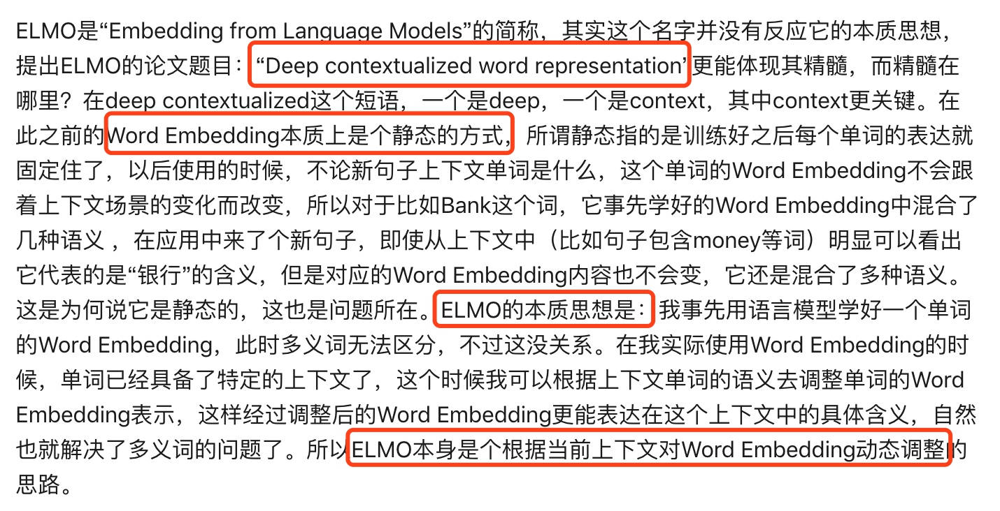
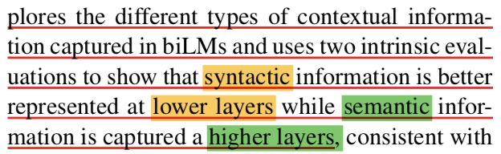
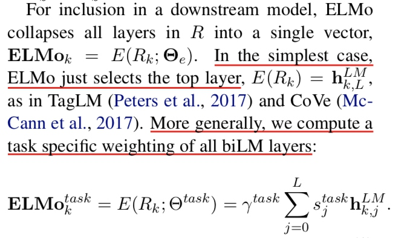
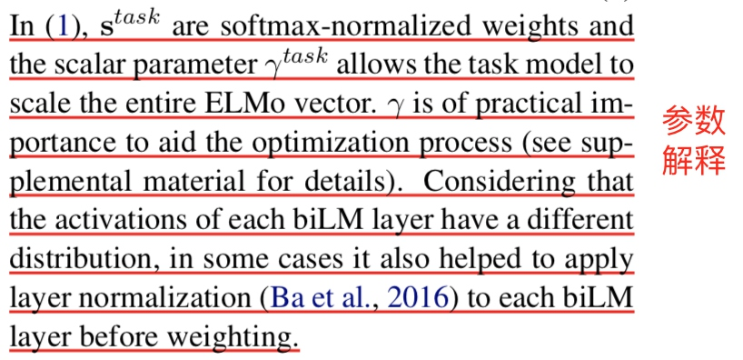

## 优秀文章阅读笔记
[张俊林 - 从Word Embedding到Bert模型—自然语言处理中的预训练技术发展史](https://zhuanlan.zhihu.com/p/49271699)
## 语言模型预训练
语言模型指语言表示方法（n-gram、NNLM神经网络语言模型），语言模型的目的是用前文预测下文。
在大语料上无监督或半监督预训练，提取各种特征供下游任务使用。
需要重点关注的是：如何提取特征、训练模式、能提取到什么特征、下游怎么使用
### Word2Vec
NNLM 和 word2vec 的两种训练方法的关系

    Word2Vec的网络结构其实和NNLM是基本类似的，它们是亲兄弟。不过这里需要指出：尽管网络结构相近，而且也是做语言模型任务，但是其训练方法不太一样。Word2Vec有两种训练方法，一种叫CBOW（连续词袋模型），核心思想是从一个句子里面把一个词抠掉，用这个词的上文和下文去预测被抠掉的这个词；第二种叫做Skip-gram（跳字-gram），和CBOW正好反过来，输入某个单词，要求网络预测它的上下文单词。回头看看，NNLM是怎么训练的？是输入一个单词的上文，去预测这个单词。这是有显著差异的。为什么Word2Vec这么处理？
原因很简单，因为Word2Vec和NNLM不一样，NNLM的主要任务是要学习一个解决语言模型任务的网络结构，语言模型就是要看到上文预测下文，而word embedding只是无心插柳的一个副产品。
但是Word2Vec目标不一样，它单纯就是要word embedding的，这是主产品，所以它完全可以随性地这么去训练网络。
fasttext 主要任务可以做分类，也可以做 词嵌入，用 char-level 的和平均，表示 word 向量。
### ELMO
Word Embedding 无法解决 多义词问题，ELMO ( Embedding from Language Models )，论文名：Deep contextualized word representation

ELMo 是一个 CNN-BIG-LSTM ，底层双向LSTM可能包含句法信息多一点，高层双向LSTM包含语义信息多一点，最后是该单词的 wordEmbedding，这三层的 Embedding 加权求和后，供给下层任务使用，权重可学习。
#### 模型结构：

简单任务只用最顶层的输出向量就行，更通用的是将各层 BiLSTM 的输出加权求和。

#### 不足：
1. 还是只能根据上文推断下文，其实没有实质上根据上下文预测单词。
2. 特征提取器 还是 LSTM，不如 Transformer ，有其固定缺陷，比如：超过一定距离，信息保留不足，不能并行。
### Bert

## 扩展
### 万物皆可 Embeddings（Embedding 思想）
将低纬向量表示事物性质，有很多很好的性质，比如：可以计算相似性、可以加减。
用 Embedding 实现实时个性搜索、推荐系统。
可以用聚类来评估效果。
在推荐系统工程实践中，可以分别对 user 和 item Embedding 成 vector，只保留 vector，不用部署模型，只计算相似性就可以找到最近邻相似对象。
[万物皆Embedding，从经典的word2vec到深度学习基本操作item2vec](https://zhuanlan.zhihu.com/p/53194407)
[不一样的论文解读2018 KDD best paper: Embeddings at Airbnb](https://zhuanlan.zhihu.com/p/49537461)