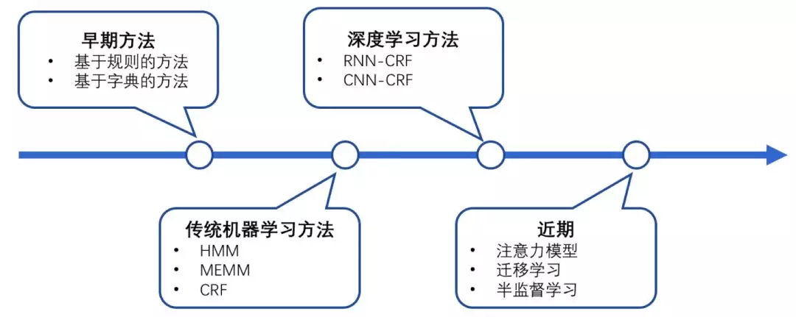
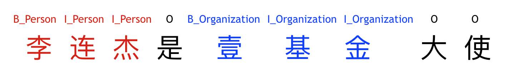
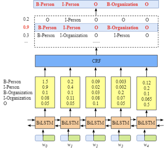
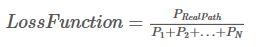
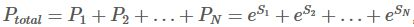
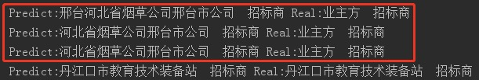

# 构建 BiLSTM + CRF 模型进行命名实体识别


## 命名实体识别问题

### 问题描述

命名实体识别  (Named Entity Recognition,NER)  的主要任务是识别出文本中的人名、地名、机构名 甚至 电影名、书名、项目名等等，将这类专有名称文本片段进行提取和分类识别。命名实体识别技术是信息抽取、信息检索、机器翻译、问答系统等多种自然语言处理技术必不可少的组成部分。这类专有名词 数量多、不断有新词涌现、结构复杂、识别难度大。下面将以简单例子介绍在命名实体识别上的主流模型 — BiLSTM + CRF 模型的原理和实现。

###常见解决方法



基于规则：比如正则

（灵活性差，需要手动构建，维护难度大，适用于简单的、实体前后有明显特征的文本）

基于词典查找

（效果好，但是仅能识别词典中存在的实体名称）

传统机器学习方法：隐马尔科夫链 HMM、条件随机场 CRF 等

（基于概率图模型，自动学习字词间的概率约束关系，省去了人工构建特征，crf 可用 CRF++工具）

深度学习模型

​	1. BiLSTM

​	2. BiLSTM + CRF

​	3. 其他神经网络结构

其他一些研究：添加注意力机制、基于残差LSTM、基于ELMo、基于Bert等

##BiLSTM + CRF 模型简介

基于 BiLSTM + CRF 的命名实体识别模型作为一个序列标注模型，主要由Embedding层（主要有词向量、字向量），双向LSTM层，以及最后的CRF层构成。其继承了深度学习方法的优势，使用字或词向量可以捕捉到丰富的特征，无需特征工程。

### 思路介绍

我们假设标签空间为 {B-Person、I-Person、B-Organization、I-Organization、O }，

- B-Person ： 表示人名首字
- I- Person ： 表示人名非首字
- B-Organization ： 表示组织名首字
- I-Organization ： 表示组织名非首字
- O ： 表示该字不属于命名实体的一部分

我们对字符序列的每一个字符预测标注上对应的标签，通过标签我们就可以提取出不同的命名实体了。如下：



人物：李连杰

组织：壹基金

序列元素的标签跟两种因素有关，第一是该序列元素，第二是邻近元素的标签，分别对应了模型的BiLSTM 层 和 CRF层。模型结构介绍如下：

### 模型结构

只通过 BiLSTM 层，不添加 CRF层 时的模型结构如下：


通过 BiLSTM层，我们就可以得到要标注的序列中每个元素对应标签空间的一个概率分布矩阵 ，这时候对每一个序列元素也可以得到一个最优标签，但是此时的标签并没有考虑标签与标签之间的转移约束关系。

添加 CRF 层以后：



在 CRF层 我们可以通过训练学习到 条件随机场中的转移概率矩阵，从而可以增加标签与标签间的约束关系特征。

### 训练

训练阶段最主要要理解模型的损失函数，模型的损失函数就是 CRF 层的损失函数，CRF损失函数由两部分组成：标注的标签序列的真实路径的分数 和 标签序列所有可能路径的总分数。这两个分数又由更基本的 发射分数和转移分数 构成。发射分数来自于 BiLSTM层 的输出，转移分数来自于 CRF 层学习到的转移概率矩阵。

损失函数是：





​	每条路径的分数：Si = 发射分数 + 转移分数

### 预测

预测过程即我们要从最后CRF层输出的各类标签的概率分布矩阵中找到那条最优的路径。这里我们用 Viterbi 算法。维特比算法是一种动态规划算法，在这里的作用是寻找所有标签路径中最可能的那条。其计算过程如下图：

![Animation of the trellis diagram for the Viterbi algorithm. After Day 3, the most likely path is ['Healthy', 'Healthy', 'Fever']](./_img/Viterbi_animated_demo.gif)


## BiLSTM + CRF Keras 实现

很幸运的是大牛们已经把上边这些复杂的算法过程封装成轮子给我们用了，我们可以通过 Tensorflow 和 Keras 很容易的实现。这里 crf 我们要用到 keras 的扩展包 [keras-contrib](https://github.com/keras-team/keras-contrib)

核心代码如下：

```python
from keras.models import Model,Input
from keras.layers import LSTM,Embedding,Dense,TimeDistributed,Dropout,Bidirectional
from keras_contrib.layers import CRF
```

```python
input = Input(shape=(max_len,))
model = Embedding(input_dim=n_words+1,output_dim=20,input_length=max_len,mask_zero=True)(input)
model = Bidirectional(LSTM(units=50,return_sequences=True,recurrent_dropout=0.1))(model)
model = TimeDistributed(Dense(50,activation='relu'))(model)
crf = CRF(n_tags)
out = crf(model)
model = Model(input,out)
model.compile(optimizer='rmsprop',loss=crf.loss_function,metrics=[crf.accuracy])
```

### 效果评估

使用了 kaggle 上的英文开源命名实体识别数据集 [NER DATASET](https://www.kaggle.com/abhinavwalia95/entity-annotated-corpus) 做训练和测试。其总共有 47959 个 Sentence，我们按 9 : 1 的比例划分 训练集 ( 43163条 ) 和测试集 ( 4796条 )。此数据集标注的命名实体及包含此命名实体的样本数如下：

- geo = 地理位置（Geographical Entity） ：24411条
- org = 组织机构 （Organization）：13512 条
- per = 人物（Person） ：12830条
- gpe = 国家（Geopolitical Entity）：17258条
- tim = 时间（Time indicator）：15759条
- art = 人工制品（Artifact）：285条
- eve = 事件（Event）：180条
- nat = 自然现象（Natural Phenomenon）：342条

根据训练的模型，我们对 4796 条测试数据进行了预测，预测结果样例如下：

```python
Word           |标注  |预测 
=================================
Independent    : O     O
candidate      : O     O
Sidi           : B-per B-per
Ould           : I-per I-per
Cheikh         : I-per I-per
ABDALLAHI      : I-per I-per
was            : O     O
inaugurated    : O     O
in             : O     O
April          : B-tim B-tim
2007           : I-tim I-tim
as             : O     O
Mauritania     : B-geo B-geo
's             : O     O
first          : O     O
freely         : O     O
and            : O     O
fairly         : O     O
elected        : O     O
president      : O     O
.              : O     O
```

对测试数据进行预测，统计每种命名实体的精确率、召回率以及 F1值 ，结果如下：

```
        precision  recall    f1-score  
        
geo       0.84      0.88      0.86     
per       0.77      0.76      0.77      
gpe       0.97      0.91      0.94      
tim       0.90     	0.84      0.87     
org       0.70      0.66      0.68      
eve       0.50      0.03      0.05        
nat       0.00      0.00      0.00        
art       0.00      0.00      0.00        
```

分析：对于训练样本数较多的 geo、per、gpe、tim、org ，BiLSTM + CRF 的模型结构较好的学习到了其数据特征，具有不错的准确率和召回率；而对于训练样本较少的 eve、nat、art 类别，模型表现出了一定的欠拟合，增加相关的样本数量，可能会有更好的效果提升。

##项目应用情况

在某运营商项目中从互联网数据中爬取到了大量的招投标文本数据，这些非结构化文本数据是无法直接使用的。因此我们需要对其中的 招标人、中标人、项目编号、项目名称等关键信息进行识别抽取，结构化，这样才能实现对这些文本数据的有效利用。在项目完成的过程中，我们主要尝试了两种方法：基于规则的方法、基于 BiLSTM+CRF 的模型方法。

### 基于规则

在项目初始我们使用了基于正则的规则来提取，随着项目需求的增加，要提取的命名实体种类越来越多，现在高达17个。然而需求每增加一种命名实体，都需要人工花大量时间查看很多的数据，总结规律，然后编写调试复杂的正则表达式，规则的复杂性和人工维护成本越来越高。基于规则的实体提取方法，可以在计算资源较差的情况下，保证一定的准确性，并且可解释性较强，不过维护成本较高，灵活性较差，不能很好的区分真正的命名实体名称和指示代词。

如在某文本中有如下描述：

“…… 业主方是某公司，…… 的招标商是业主方。……”

根据正则的规则提取到的招标商是指示代词：业主方，三个字。而实际的却应该是指示代词所指定的实际的命名实体名称。因此我们去尝试了基于神经网络的模型。

### 基于 BiLSTM + CRF 模型

使用神经网络模型的话，其最大的问题在于用于模型训练的标注数据获取难度较大。项目需要提取的命名实体种类高达17个，人工标注数据的话工作量特别大，因此初期应用我们仅标注了三个字段：招投标项目编号、招标商名称、中标商名称。在标注过程中，我们采取了规则处理结合人工检查的标注方法，即：先使用之前开发的规则提取程序提取出结构化信息再人工对提取出的结果进行检查、修正、补全。

在利用 规则+人工检查 标注了一定量的训练数据后，我们训练了基于 BiLSTM + CRF 的神经网络模型。在同一批测试集上，分别用现有的规则 和 基于 BiLSTM + CRF 的神经网络模型进行命名实体识别，对结果进行对比，部分数据如下：

Predict为 BiLSTM + CRF 模型结果，Real为 基于规则的输出结果


我们发现基于BiLSTM + CRF 的神经网络模型，很好的根据文本上下文信息和特征，识别出了真正的命名实体。而基于规则的提取方式，仅提取出了指示代词本身。

### 分析

基于神经网络模型的命名实体识别虽然精确度高，但在计算资源有限的情况下，对计算实时性满足能力较差，且可解释性不强，而基于规则的命名实体提取则在计算资源较差的情况下，对准确性有一定的保证，可解释性强，不过维护成本较高。在实际项目中，规则用于实时提取，模型用于特殊场景纠错，两者相互辅助则能显著提高程序整体的效率和表现。

## 参考文档链接

[最通俗易懂的BiLSTM-CRF模型中的CRF层介绍](https://zhuanlan.zhihu.com/p/44042528)

[Sequence Tagging With A LSTM-CRF](https://www.depends-on-the-definition.com/sequence-tagging-lstm-crf/)

[命名实体识别研究进展综述](http://manu44.magtech.com.cn/Jwk_infotech_wk3/article/2010/1003-3513/1003-3513-26-6-42.html)

[维特比算法](https://zh.wikipedia.org/wiki/%E7%BB%B4%E7%89%B9%E6%AF%94%E7%AE%97%E6%B3%95)

