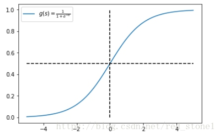

先看完 数学-《数学符号体系》下的指数函数再看这个。
《机器学习模型原理》-> 《激活函数》
### Sigmoid 
```mathjax
g(x)= \frac{1}{1+e^{-x}}
```

### 很好的性质
1. 导数计算非常方便
```mathjax
f(x)= \frac{1}{1+e^{-x}}\\
f'(x) = ( - 1){(1 + {e^{ - x}})^{ - 2}}(0 + ( - 1){e^{ - x}}) \\= \frac{{{e^{ - x}}}}{{{{(1 + {e^{ - x}})}^2}}} \\= \frac{{{e^{ - x}}}}{{1 + {e^{ - x}}}}\frac{1}{{1 + {e^{ - x}}}}\\
=(1-\frac{{{1}}}{{1 + {e^{ - x}}}})\frac{1}{{1 + {e^{ - x}}}}\\
=(1-f(x))\cdot f(x)
```

### 推导
1. [Sigmoid函数推导（逻辑回归激活函数来历）](https://blog.csdn.net/weixin_38275649/article/details/80340538)
2. [Sigmoid函数](https://blog.csdn.net/saltriver/article/details/57531963)
    [指数分布族](https://blog.csdn.net/saltriver/article/details/55105285)
    [伯努利分布](https://zh.wikipedia.org/wiki/%E4%BC%AF%E5%8A%AA%E5%88%A9%E5%88%86%E5%B8%83)
## sigmoid 函数与指数分布族
[Sigmoid函数](https://blog.csdn.net/saltriver/article/details/57531963)
[指数分布族（The Exponential Family)与广义线性回归（Generalized Linear Model GLM）](https://blog.csdn.net/bitcarmanlee/article/details/51292380)
[exponential family distribution（指数族分布）](https://blog.csdn.net/lanchunhui/article/details/54287606)
