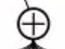
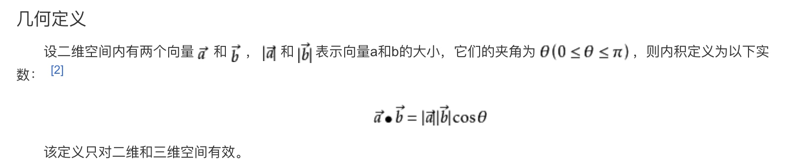
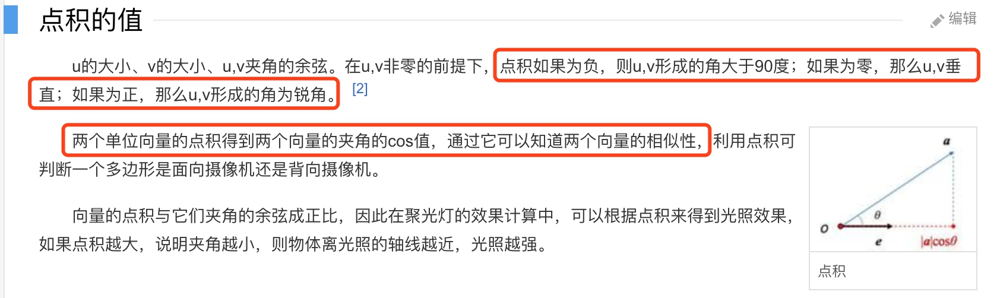
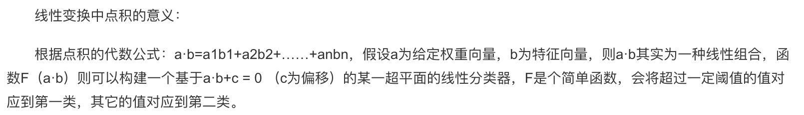
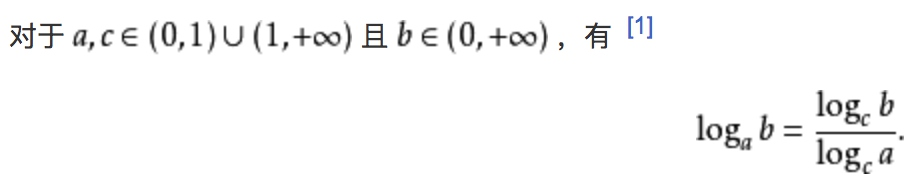

## 数学符号体系（todo）
[一文介绍机器学习中基本的数学符号](https://www.jiqizhixin.com/articles/basics-mathematical-notation-machine-learning)
这文章介绍的也不全，接着找找总结一下
累加、累乘
表示拼接
表示点乘、点积，位乘求和，卷积运算
圈叉 表示 叉乘，矩阵相乘
## 基本运算
万物起源只有加法，
减法是加法的逆运算；
乘法等价于**自加**运算，
除法是乘法的逆运算；
幂等价于**自乘**运算，（底数^指数=值）
幂的逆运算有两个：开方和求对数。
开方是根据值和和指数求底数，求对数是根据值和底数求指数。
### 向量矩阵运算
点积/内积/点乘
（一般用两个向量的内积大小，表示向量的相似性）
叉积/外积/叉乘
内积的几何意义（两个力的合力，越大说明两个力之间的夹角越小。）




外积可表示两个向量围成平行四边形的面积。
[向量点乘（内积）和叉乘（外积、向量积）概念及几何意义解读](https://blog.csdn.net/dcrmg/article/details/52416832)
[内积、标量积、点积、点乘](https://blog.csdn.net/zhiyi_2012/article/details/12972813)
[点积百度百科](https://baike.baidu.com/item/%E7%82%B9%E7%A7%AF)
[点积wiki](https://zh.wikipedia.org/wiki/%E7%82%B9%E7%A7%AF)
##函数
合理理解 幂函数、指数函数、对数函数
指数函数和对数函数互为反函数。
### 指数函数
不同底数的指数函数之间是可以相互转换的，只是一种表示形式而已。例如：
```mathjax
2^t = e^{at}   （a=ln2=0.69315...）
```
#### 指数函数求导
导数即变化率，即单位时间的数量变化个数。
实际发现，指数函数在t时刻的导数都等于一个常数乘以这个指数函数在t时刻的值，如下：
```mathjax
(2^t)' = a\cdot (2^t)\qquad(a=0.6931...)\\
(8^t)' = a\cdot (8^t)\qquad(a=2.0794...)
```
那这个常数 a 到底有什么规律呢，什么时候 a 为1，发现当底数是 e 的时候，a = 1，即以 e 为底的指数函数其导数即是自身，即：
```mathjax
(e^t)'=a\cdot(e^t)=e^t\qquad(a=1)
```
不同底数的指数函数都可以转换成以 e 为底的函数，
```mathjax
2 = e^{ln2}\\
2^t = e^{ln2\cdot t}\\
(2^t)’ = (e^{ln2\cdot t})'=ln2 \cdot e^{ln2\cdot t}=ln2\cdot 2^t \qquad \\
(这里用到了复合函数求导的链式法则)\\
```
所以这里：
```mathjax
(2^t)' =a\cdot(e^t)= ln2\cdot (2^t)\qquad(a=ln2=0.6931...)\\
```
所以指数函数的求导法则就是：
```mathjax
(a^t)' = lna\cdot (a^t) \qquad(a>0\neq 1)
```
##### 用 e 做底的好处
所以，这里每一个用e做底的指数函数幂上的常数 a 都有了实际意义，都表示 数量本身 和 变化率(即：导数) 两者的比例系数。
### 对数函数
log 在很多公式中不写的话，底默认有时候是2，有时候是e，根据不同场景来看，

#### 换底公式

#### 数据取对数的意义
[数据取对数的意义](https://www.cnblogs.com/zztt/p/3409675.html)


