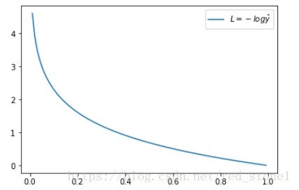
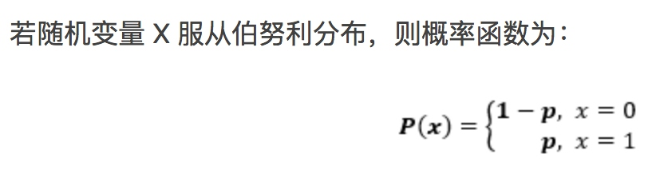

# 熵
熵 是无序的度量。为什么可以度量无序？
能量守恒，但是可以转化。
　　能量的总和 = 有效能量 + 无效能量
"有效能量"指的是，可以被利用的能量；"无效能量"指的是，无法再利用的能量，又称为熵。所以，熵就是系统中的无效能量。
考虑到宇宙的能量总和是一个常量，而每一次能量转化，必然有一部分"有效能量"变成"无效能量"（即"熵"），因此不难推论，有效能量越来越少，无效能量越来越多。热力学第二定律的一个重要推论就是：熵永远在增加。
所以熵越大，表明转化次数越多，表明越无序。
[熵的社会学意义](http://www.ruanyifeng.com/blog/2013/04/entropy.html)
## 信息熵
[最好的解释信息熵的文章](https://blog.csdn.net/saltriver/article/details/53056816)
根据香农(Shannon)给出的信息熵公式，对于任意一个随机变量X，它的信息熵定义如下，单位为比特(bit)：
```mathjax
H(X)=-\sum_{x\varepsilon X}^{}P(x)logP(x))
```
这里 log 默认的底应该是2。
从香农给出的数学公式上可以看出，信息熵其实是一个随机变量信息量的**数学期望**。（[数学期望-wiki](https://zh.wikipedia.org/wiki/%E6%9C%9F%E6%9C%9B%E5%80%BC)）

## 交叉熵是什么
[简单的交叉熵损失函数，你真的懂了吗？](https://blog.csdn.net/red_stone1/article/details/80735068?_t=1536798091)
写得非常好，一定要好好读几遍。
交叉熵损失函数是一类函数，只介绍最常见的一种：
交叉熵损失函数 「Cross Entropy Loss」：
```mathjax
L=-[ylog\ \hat y+(1-y)log\ (1-\hat y)]
```
当 y = 1 时：
```mathjax
L=-log\ \hat y
```

当 y = 0 时：
```mathjax
L=-log\ (1-\hat y)
```

重点是，从图形中我们可以发现：预测输出与 y 差得越多，L 的值越大，也就是说对当前模型的 “ 惩罚 ” 越大，而且是非线性增大，是一种类似指数增长的级别。这是由 log 函数本身的特性所决定的。这样的好处是模型会倾向于让预测输出更接近真实样本标签 y。 也就是说，惩罚力度越大，那么收敛就会越快，这是一个很好的性质。
- - - - -
### 交叉熵推导过程
伯努利概率分布函数：

概率分布分段函数整合在一起：
```mathjax
P(y|x)=\hat y^y\cdot (1-\hat y)^{1-y}
```
> 概率分布和概率表达式为什么是这样子的？参考：《数学-2018-09-16 概率分布》

整合之后的概率表达式，我们希望的是概率 P(y|x) 越大越好。我们对 P(y|x) 引入 log 函数，因为 log 运算并不会影响函数本身的单调性。则有：
```mathjax
log\ P(y|x)=log(\hat y^y\cdot (1-\hat y)^{1-y})=ylog\ \hat y+(1-y)log(1-\hat y)
```
我们希望 log P(y|x) 越大越好，反过来，只要 log P(y|x) 的负值 -log P(y|x) 越小就行了。那我们就可以引入损失函数，且令 Loss = -log P(y|x)即可。则得到损失函数为:

```mathjax
L=-[ylog\ \hat y+(1-y)log\ (1-\hat y)]
```
### 为什么要叫交叉熵？熵是什么？ 为什么要取 log？
中文翻译 真 TM 坑爹，交叉熵 英文翻译是 「Cross Entropy 」，Cross 的翻译有：十字形、交叉、杂交、混合的意思，翻译成 “交叉” 就很难理解，翻译成 “混合” 就很好理解了，把 0 和 1 的情况混合在一起。
熵 是什么？ 看 (NLP/数学和NLP/2018-08-22 数学之美/熵)
## 条件熵
## 相对熵


