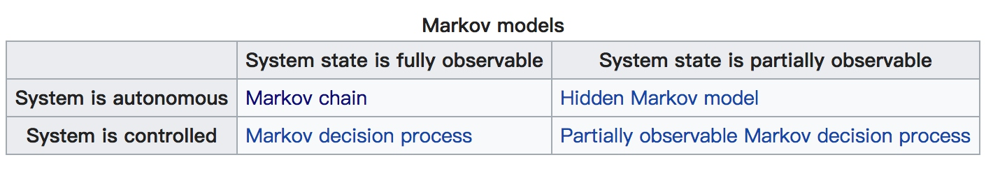

# Markov
[Markov model wiki](https://en.wikipedia.org/wiki/Markov_model)

```table
|-|系统状态完全可观测|系统状态部分可观测
自主系统|马尔科夫链|隐马尔科夫
可控系统|马尔科夫决策过程|部分可观测的科尔科夫决策过程
```

## 参考资料
[Markov Chains 可视化动图解释 - setosa](http://setosa.io/ev/markov-chains/)
[马尔可夫链模型-zhihu](https://www.zhihu.com/question/26665048/answer/274841241)
关键词：状态分布矩阵、转移概率矩阵（保持不变的）
总结：某一时刻的状态分布只依赖于其前一个状态，跟其他状态无关。


## 马尔科夫收敛
[马尔科夫链的收敛性质](https://www.cnblogs.com/pinard/p/6632399.html)
判断马尔科夫链是否可收敛？
1）**非周期的马尔科夫链**：这个主要是指马尔科夫链的状态转化不是循环的，如果是循环的则永远不会收敛。幸运的是我们遇到的马尔科夫链一般都是非周期性的。用数学方式表述则是：对于任意某一状态i，d为集合{n∣n≥1,Pnii>0} 的最大公约数，如果 d=1 ，则该状态为非周期的。
2）**任何两个状态是连通的**：这个指的是 **从任意一个状态可以通过有限步到达其他的任意一个状态，不会出现条件概率一直为 0 导致不可达的情况** 。
在 PageRank 会两个异常情况：一种是只有流入没有流出的 和 流入流出都没有
修正“悬挂网页”带来的不良影响
这里有一个问题：即便 PR 0 的取值对最终结果没有影响，用 PR 作为网页排序的依据是否真的合理？
其实并不合理，因为当一个网页只有链入链接没有链出链接的时候，这个网页就会像一个“黑洞”一样，将同一个连通子图中其它网页流向它的 PageRank 慢慢“吞掉”（因为算法中虚拟的用户一旦进入那样的网页， 就会由于没有对外链接而永远停留在那里），这种网页我们称之为“悬挂网页”（ Dangling Link ）。这种“黑洞”效应是如此显著， 以至于在一个连通性良好的互联网上， 哪怕只有一个 “悬挂网页”， 也足以使整个互联网的网页排序失效， 可谓是 “一粒老鼠屎坏了一锅粥”。
不仅一个 Node ，几个 Node 也可能构成一个小循环 ，导致流入这个小循环的就流不出去了。
3）**马尔科夫链的状态数可以是有限的**，也可以是无限的。因此可以用于连续概率分布和离散概率分布。
4）π通常称为马尔科夫链的平稳分布。
## HMM（隐马尔可夫模型）
[ 一文搞懂HMM（隐马尔可夫模型）](http://www.cnblogs.com/skyme/p/4651331.html)
[ 隐马尔科夫模型（HMM)及其扩展 ](https://blog.csdn.net/stdcoutzyx/article/details/8522078)
隐马尔科夫 分词原理源码查看
### 定义
隐马尔科夫模型由三个概率分布确定，也即隐马尔科夫模型的三要素，  初始概率分布（向量）、状态转移概率分布（矩阵）、观测概率分布（矩阵）。
由定义可知其做了两个基本假设：齐次马尔科夫性假设 和 观测独立性假设

## Viterbi（维特比算法）
[ wiki 维特比算法](https://zh.wikipedia.org/wiki/%E7%BB%B4%E7%89%B9%E6%AF%94%E7%AE%97%E6%B3%95)
Viterbi 算法 jieba 源码查看
## CRF 条件随机场
### BiLSTM + CRF 做 NER（命名实体识别）

