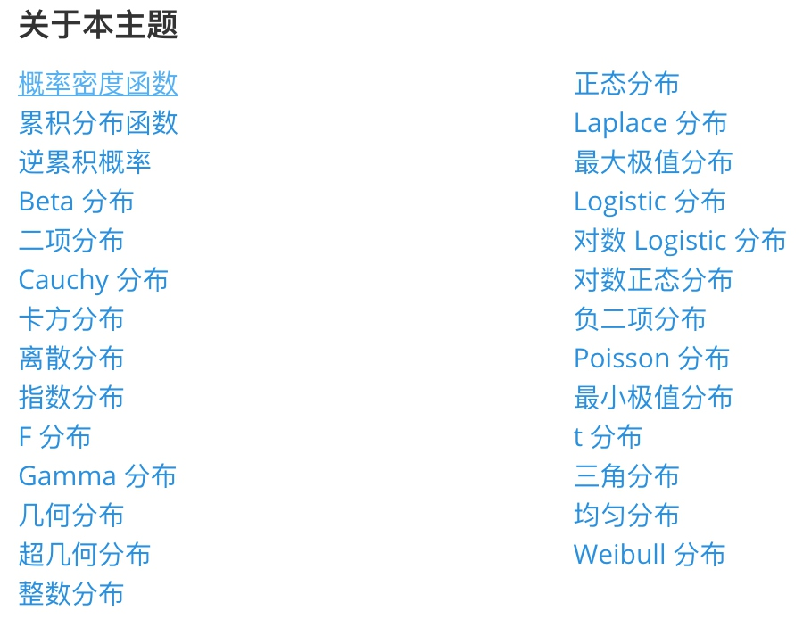
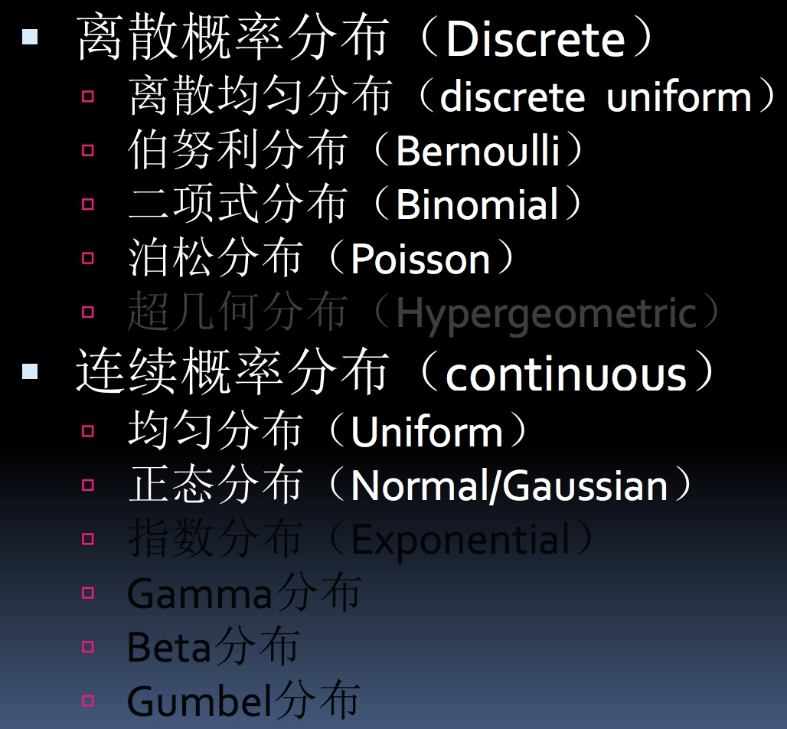
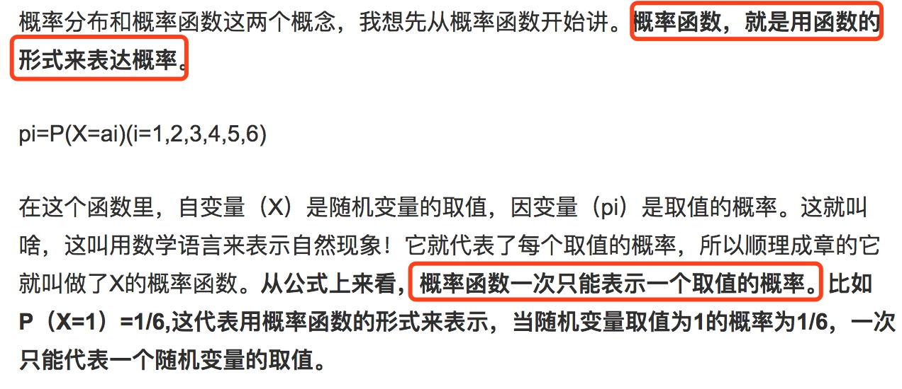
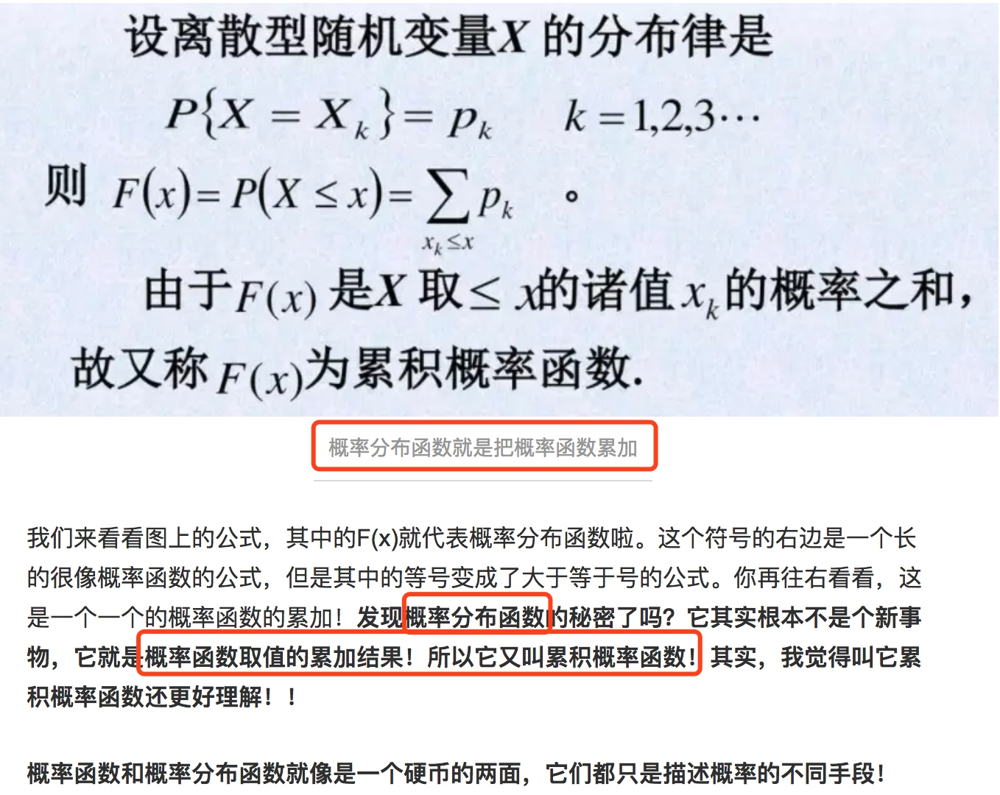
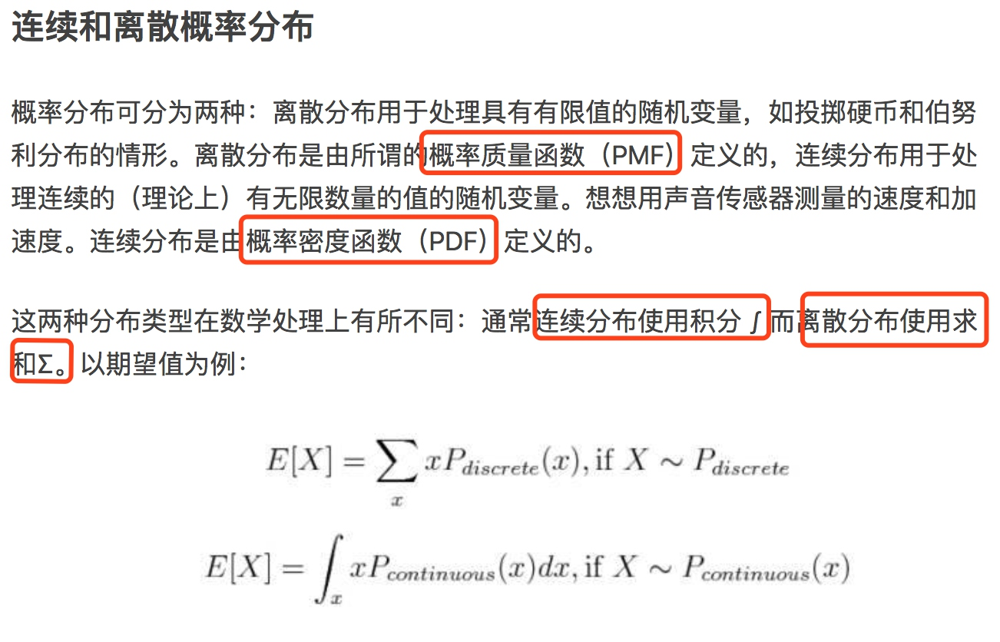
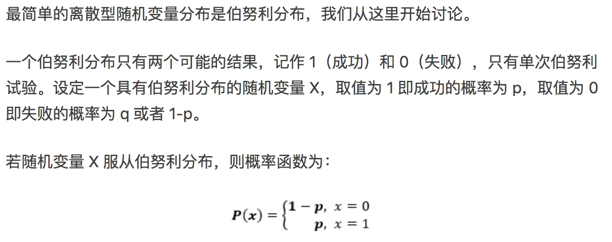
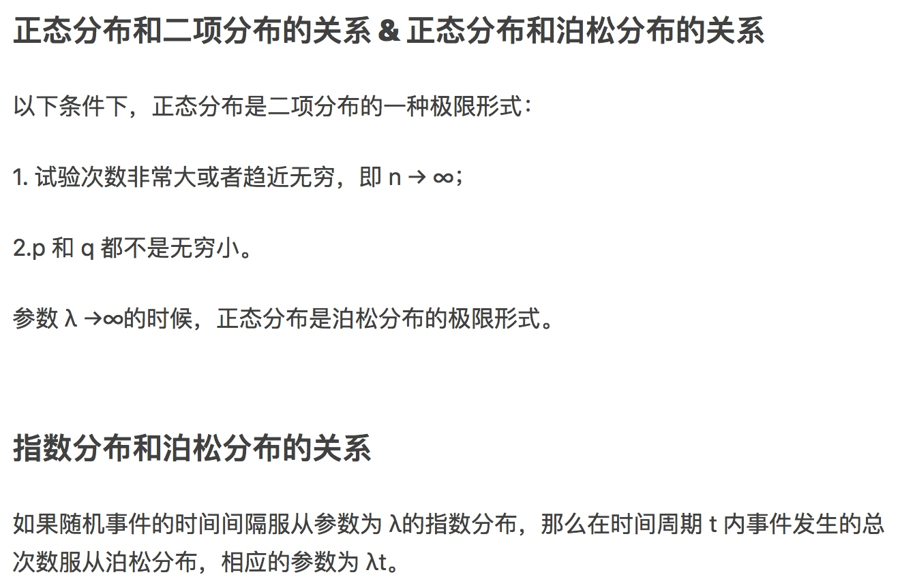

## 概率分布
离散概率分布和连续概率分布

[从贝叶斯定理到概率分布：综述概率论基本定义-机器之心](https://www.jiqizhixin.com/articles/2017-09-20-10)

[概率分布 的方法和公式](https://support.minitab.com/zh-cn/minitab/18/help-and-how-to/probability-distributions-and-random-data/how-to/probability-distributions/methods-and-formulas/methods-and-formulas/)

[读了本文，你就懂了概率分布-zhihu](https://zhuanlan.zhihu.com/p/26810566)

[常用概率分布](http://cbb.sjtu.edu.cn/~mywu/bi217/3.pdf)

## 整体印象

泊松分布

正态分布（高斯分布）

指数分布（幂律分布）

### 概念
数学期望和方差

[数学期望-wiki](https://zh.wikipedia.org/wiki/%E6%9C%9F%E6%9C%9B%E5%80%BC)

[数学期望-baidu](https://baike.baidu.com/item/%E6%95%B0%E5%AD%A6%E6%9C%9F%E6%9C%9B)

概率质量函数（PMF,又叫：概率函数、分布律）

概率分布函数（又叫：累积概率函数、分布函数）

概率密度函数（PDF,连续型随机变量的概率函数叫概率密度函数）

[应该如何理解概率分布函数和概率密度函数？](https://www.jianshu.com/p/b570b1ba92bb)

### 伯努利分布

### 二项分布
如果存在一组相同的随机事件，即一组伯努利试验，在上例中为连续掷硬币多次。那么某随机事件出现的次数即概率服从于二项分布，也称为多重伯努利分布。

## 指数分布族（exponential family）

[指数分布族](https://blog.csdn.net/saltriver/article/details/55105285)

“指数分布族(exponential family)”，不是“指数分布(exponential distribution)”，指数分布族在上世纪30年代中期被提出，在概率论和统计学中，它是一些有着特殊形式的概率分布的集合，包括许多常用的分布，如正态分布、指数分布、伯努利分布、泊松分布、gamma分布、beta分布等等。指数分布族为很多重要而常用的概率分布提供了统一框架，这种一般性有助于表达的方便和从更大的宏观尺度上理解这些分布。

