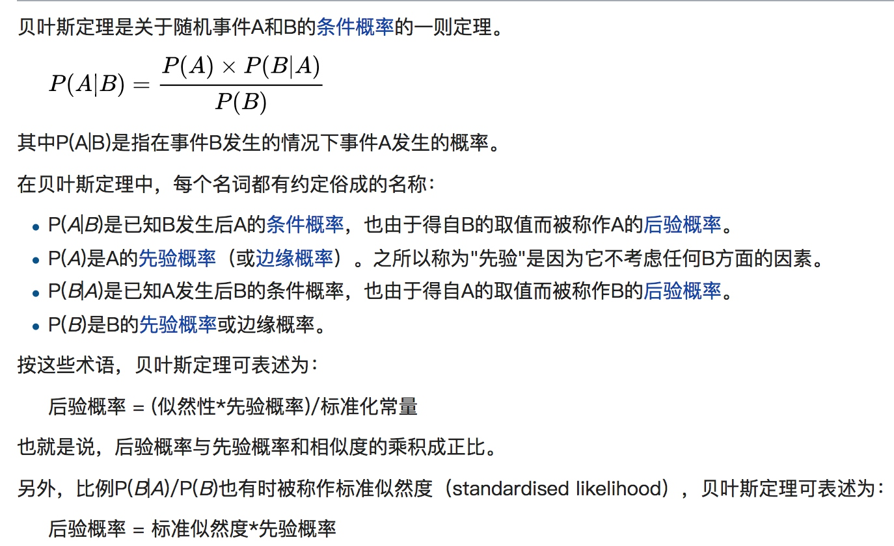
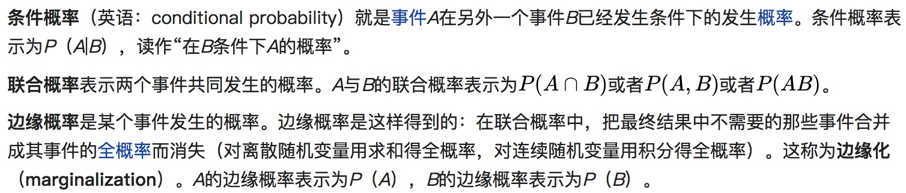
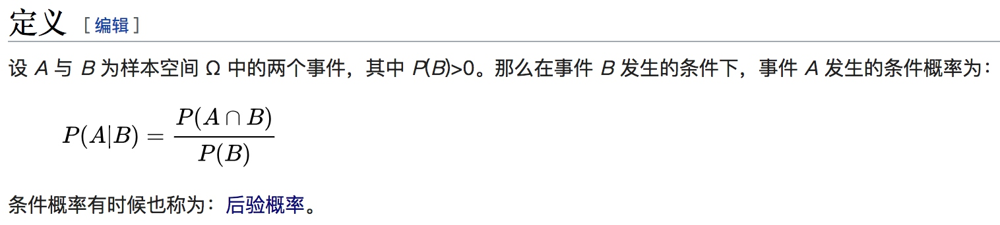

## 概率论
[从贝叶斯定理到概率分布：综述概率论基本定义-机器之心](https://www.jiqizhixin.com/articles/2017-09-20-10)
[Conditional probability 条件概率的最好可视化-setosa.io](http://setosa.io/ev/conditional-probability/)

[概率论](https://zh.wikipedia.org/wiki/%E6%A6%82%E7%8E%87%E8%AE%BA)
## 贝叶斯定理

[最好的贝叶斯定理解释-wiki](https://zh.wikipedia.org/wiki/%E8%B4%9D%E5%8F%B6%E6%96%AF%E5%AE%9A%E7%90%86)
## 名词解释
边缘概率

条件概率、后验概率

[先验概率](https://zh.wikipedia.org/wiki/%E5%85%88%E9%AA%8C%E6%A6%82%E7%8E%87)
在贝叶斯统计中，某一不确定量p的**先验概率**分布是在考虑"观测数据"前，能表达p不确定性的概率分布。
在使用贝叶斯定理时，我们通过将先验概率与似然函数相乘，随后标准化，来得到后验概率分布。
先验概率通常是建立在主观假设下的，或者说是主观经验判断或“直觉”，为了使计算后验概率方便，有时候会选择共轭先验。
[后验概率](https://zh.wikipedia.org/wiki/%E5%90%8E%E9%AA%8C%E6%A6%82%E7%8E%87)
## 贝叶斯定理可视化
[Conditional probability 条件概率的最好可视化-setosa.io](http://setosa.io/ev/conditional-probability/)