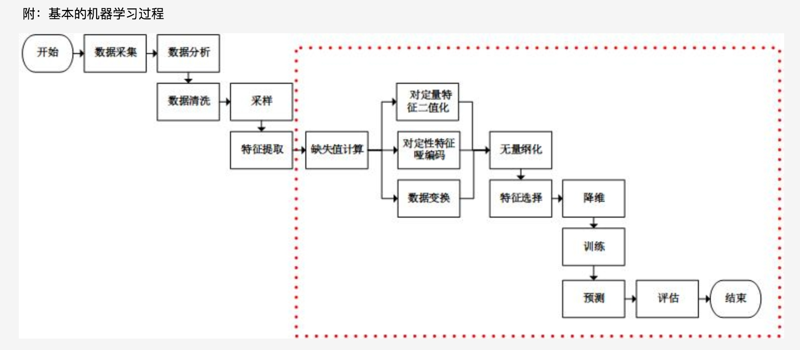

# 数据和特征决定了机器学习的上限，算法和模型只是为了逼近这个上限而已。

## 数据挖掘流程
1. 提出需求和问题。根据普通会员数据找出哪些会员更有可能办年卡
2. 分析问题，定义转化成具象问题。
    * 这是一个什么问题？分类？回归
    * 正样本和负样本是什么？label是什么？数据有普通会员历史消费数据，正样本取 18年3月1号之前升级为年卡的普通会员的升级为年卡前的消费数据。负样本取18年3月1号之前还没有升级为年卡的普通会员卡的消费数据。label 是是否升级成了年卡。
3. 数据处理
    * 获取数据，从业务系统提取数据，提取什么数据和字段
    * 数据清洗，处理异常值和空值
4. 特征工程
    * 确定特征提取思路，提取特征
    * 归一化、OneHot
5. 训练模型
    * 确定评判标准，AUC等
    * 划分数据集，训练集、测试集、验证集
    * 交叉验证
    * 调参
6. 过拟合和欠拟合的判断和处理
    * 学习曲线
    * 正则化
- - - - -
## 499项目中遇见的问题
### 数据清洗
#### 异常值处理
1. 将用户单数、金额、消费天数画成散点图，有些不正常消费数据
2. 年卡升级记录中有些人有多条记录，有开卡、退卡、再开卡的现象，不多，暂时剔除掉了。
3. 用会员手机号做标示，查看时发现一些 1050000开头的，非正常手机号格式的数据，经了解是测试用的，也过滤掉了
#### 空值处理
没有发现空值。在 Titanic 项目中有，一般可以取众数，平均数
### 特征工程中
#### 特征提取思路
如何从消费数据中提取特征？能想到的特征杂乱零散，怎么保证不漏掉重要特征？怎么有组织有思路的去提取呢。
后来我又重新思考和定义问题的本质。
从普通会员卡用户消费数据中找出那些后来升级年卡的人，本质还是分析用户的消费行为特征。
消费是什么？即：**什么样的人什么时间在什么样的地方购买了什么样的东西。**
所以提取特征我就从 人、门店、商品、时间四条线上去思考了。
现在只考虑了人和店，最近30天的消费特征。
#### 最近30天的特征处理
正样本取的每个人办卡日期前30天的数据，负样本取的3月1号之前30天的数据。主要有四个特征，
* 用户这30天内共消费多少单
* 用户这30天内共消费多少元
* 用户这30天内平均每天消费多少单
* 用户这30天内平均每天消费多少元
提升很大的原因，应该是一下子过滤掉了很多的僵尸户，以前历史的消费和均天特征只能代表用户长期的消费水平，有可能用户只是以前消费很高，可是最近不来店里了，去他们店了，显然最近30天依然有消费记录的顾客有跟大可能性会升级成年卡。
#### 一人多店消费处理
一个人多店时，取多个店的均值
### 模型训练
#### 数据不均衡问题
见同目录下特征工程的文章。
### 有较大提升的地方
1. 整合了门店的特征，
2. 选择了 Random Forest 后比逻辑回归和 K-Mean 提升很多，从 0.6几 到了 0.74-0.75 左右
3. 加了用户最近30天的特征以后，一下子从 0.75 提升到了 0.87-0.88 
### 还可以改进的地方
1. 17年8月1号之前的数据因为是老系统的数据，门店编码和商品品类编码的规则都变了，不太好整理。导致并不能提取到大部分会员的完整的历史消费信息。
2. 还有很多特征没有去添加， 比如：商品类的特征，有些特征暂时获取不到，比如用户的年龄，性别特征
3. 数据量还是相对较少
- - - - -
## 防止过拟合的方式：
1. 正则化
2. 交叉验证
3. 减少特征数量（降维PCA）
4. 增加训练数据集大小

