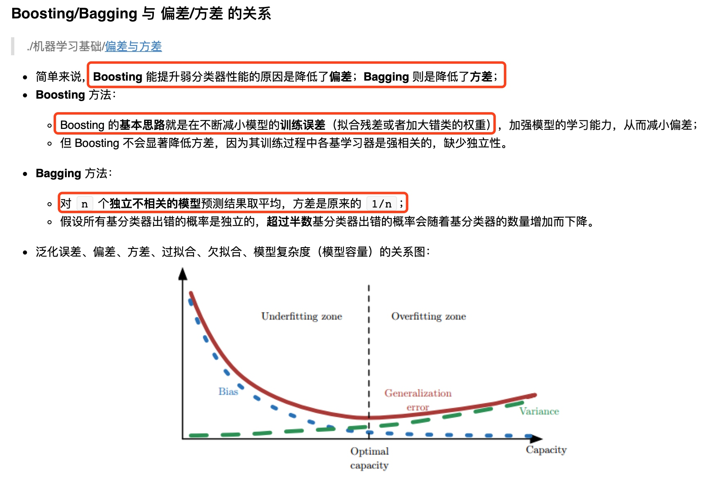

## 模型分类
1. 分类、回归、聚类
2. 生成模型、判别模型
## 提高模型泛化能力
### 正则化
经验风险最小化 和 结构风险最小化
经验风险最小化：损失函数的最小化
结构风险最小化：使用正则化项让结构变得平滑，惩罚项
### 交叉验证
训练集、验证集、测试集
训练集作用：用于模型的训练和学习，为了让模型学习到训练集中蕴含的深层次的“经验和规律”。
验证集作用：用于模型评估、选择和调参，
测试集作用：用于对比不同算法的泛化性能
实际使用时一般只切分为训练集和测试集，模型训练时算法库，比如：scikit learn 做交叉验证时，一般会自动从训练集中根据算法不同划分出验证集，做交叉验证自动处理。
- - - - -
# 模型详解
## 描述分类 what
### 是什么，可以干什么，什么类别
## 原理 why
## 怎么用 how
### 需要注意什么
## 优缺点
## 过拟合和欠拟合的判断和处理
- - - - -
# 随机森林
[决策树](https://zh.wikipedia.org/wiki/%E5%86%B3%E7%AD%96%E6%A0%91)
[随机森林](https://zh.wikipedia.org/wiki/%E9%9A%8F%E6%9C%BA%E6%A3%AE%E6%9E%97)
[对于随机森林的通俗理解](https://blog.csdn.net/mao_xiao_feng/article/details/52728164)
## 描述和分类
随机森林是一个包含多个**决策树**的**分类器**，并且其输出的类别是由个别树输出的类别的**众数**而定。
基于决策树容易过拟合的缺点，随机森林采用多个决策树的投票机制来改善决策树。
## 原理 why
随机变量：决策树数量m、每次样本数n、每次取k个特征
三个随机过程可以有效控制过拟合
假设有N个样本，每个样本有K个特征，训练产生 m 个决策树
1. 生成样本，从全量样本N中有放回的取出n个样本（为什么不全量样本呢？全量样本忽略了局部样本的规律性，不利于模型的泛化能力）
2. 从选取的n个样本的总K个特征中随机选取k（k小于K）个特征来做训练
3. 用n个样本和选取的k个特征，用建立决策树的方式来获取最佳分割点
4. 循环m次，1、2、3过程，生成m个决策树
5. 用多数投票机制进行预测
## 优点
1. 因为每棵树每次取样n都是随机的，且是多数投票机制产生预测结果，所以对异常值、空值不敏感
2. 决策树生长过程是寻找最佳分割点，不涉及距离计算，所以树模型可以不用one-hot，one-hot以后反而增加了特征纬度，导致树深度变深
- - - - -
# K-mean 算法（K均值算法）
## 算法原理
```
选择K个点作为初始质心（随机产生或者从D中选取）  
repeat  
    将每个点分配到最近的质心，形成K个簇  
    重新计算每个簇的质心  
until 簇不发生变化或达到最大迭代次数  
```
## 优缺点
因为每次初始质心选择是随机的，所以最后收敛结果可能会不一样。
- - - - -
# PCA 主成分分析法？
## what
很多纬的特征中，可能存在多个特征反应的是统一规律，即存在很大的相关性。PCA可以找出特征之间的相关性，通过线性变换，合并转换为一维特征，叫主成分。查看特征是否共线性。
PCA 是一种特征降维的技术，通过将高维空间的数据正交投影到低纬子空间，使投影空间中数据的方差最大化，也可以理解为最小化从投影数据恢复到原数据的误差。在这个过程中会尽量保持原有数据的主要信息。
特征降维
## 降维的好处和缺点
降维以后，可以丢弃一些噪声，更容易看出主成分的规律性，而且纬度减少以后，数据存储和分类性能更高了。缺点是在降维过程中可能会丢失一些特征。
# 逻辑回归
what  
假设函数是：sigmoid函数，
最优化方法：梯度下降
# 支持向量机
what
原理：将特征投射到高维空间，使其线性可分，然后找到能正确划分训练集，并且使几何间隔最大化的分离超平面。
低纬空间到高纬空间的映射利用了核函数。
离分离超平面最近的点叫支持向量，分离超平面的确定只与支持向量有关。
很多时候并不总是线性可分的，允许一定异常点存在的，叫软间隔最大化
# GBDT
梯度提升树算法
[梯度提升决策树GBDT](https://blog.csdn.net/google19890102/article/details/51746402)
# XGBoost
是GBDT的一种优化实现
# 集成学习方法
boosting、bagging、stacking

# 其他
[RF、GBDT、XGBoost、lightGBM原理与区别](https://blog.csdn.net/data_scientist/article/details/79022025)
[gbdt,xgboost与lightgbm](http://matafight.github.io/2017/08/29/gbdt-xgboost%E4%B8%8Elightgbm/)
[RF,GBDT,XGBoost,lightGBM的对比](https://blog.csdn.net/u014248127/article/details/79015803)

# 训练模型的保存和恢复
[训练模型的保存与恢复（sklearn-joblib）](https://blog.csdn.net/dream_angel_z/article/details/47175373)


