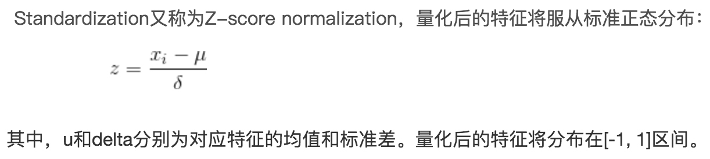

# 数据预处理
[wepon数据预处理](https://blog.csdn.net/u012162613/article/details/50629115)
## 数据标准化
[数据标准化/归一化normalization](https://blog.csdn.net/pipisorry/article/details/52247379)
### 连续型特征归一化
**数据的标准化**（normalization）是将数据按比例缩放，使之落入一个小的特定区间。在某些比较和评价的指标处理中经常会用到，去除数据的单位限制，将其转化为无量纲的纯数值，** 便于不同单位或量级的指标能够进行比较和加权 ** 。其中最典型的就是数据的归一化处理，即将数据统一映射到[0,1]区间上。
#### 为什么这么做？优点
使不同量级和单位的特征能够缩放到同一区间，在学习过程中，能让模型更快收敛
1. 提升模型的收敛速度
2. 使不同维度上的特征在数值上有一定的比较性，能提高分类器的准确性
3. # 深度学习中数据归一化可以防止模型梯度爆炸。梯度下降时步长选择更容易一些，不至于太大或太小
#### 怎么做？
常用两种方法，min-max标准化(归一化) 和 z-score 标准化
1. min-max标准化，使数值落到了 [0,1] 区间内
 
2.  z-score 标准化，也叫标准差标准化
 经过处理的数据符合标准正态分布，即均值为0，标准差为1，

  
##### min-max标准化(归一化) 和 z-score 标准化的区别，怎么选择
画散点图或根据经验，如果原始数据符合正态分布的话，用 z-score 标准化。
### 离散型特征，One-Hot Encoding
#### 为什么？
比如：不同颜色可能用1，2，3，4，5，6来表示，模型往往会把他们当作连续型数值变量处理（在欧式空间里向量距离不等，就提供了一个潜在的大小排序，会影响输出结果），但实际他们之间并没有什么关系，是非连续离散等距离的。one-hot 以后，向量距离均相等了。
#### 怎么做？
{1，2，3，4}
表示成了:
``` 
{   1,0,0,0
    0,1,0,0
    0,0,1,0
    0,0,0,1 }
```
#### 有什么弊端？
纬度爆炸，假如有一个维度颜色，有100中类别，oneHot以后原来的一个纬度，就变成了100个纬度。
缺点：当类别的数量很多时，特征空间会变得非常大。在这种情况下，一般可以用 **PCA **来减少维度。而且 **one hot encoding+PCA** 这种组合在实际中也非常有用。
#### 什么情况下不用 one-hot
不用：将离散型特征进行one-hot编码的作用，是为了让距离计算更合理，但如果特征是离散的，并且不用one-hot编码就可以很合理的计算出距离，那么就没必要进行one-hot编码。 
有些**基于树的算法**在处理变量时，并不是**基于向量空间度量**，数值只是个类别符号，即没有偏序关系，所以不用进行独热编码。  Tree Model不太需要one-hot编码： **对于决策树来说，one-hot的本质是增加树的深度。**
# 不均衡数据处理
比例超过4:1视为不均衡
## 评测指标用 AUC
## 训练集采样处理方式
对小类别集过采样，对大类别集欠采样,归到 1:2.5 左右效果比较好,
一般处理方法，欠采样和过采样，周志华《机器学习》，使用集成学习，每个分类器上欠采样，总体完整使用了整个特征集。
# 如何划分测试集
## 时序类数据
### 滑窗法
根据训练时间区间和预测时间区间划分
- - - - -
# 特征选择
[结合Scikit-learn介绍几种常用的特征选择方法](https://blog.csdn.net/Bryan__/article/details/51607215)
[特征选择(feature selection)](http://blog.csdn.net/u012328159/article/details/53954522)

