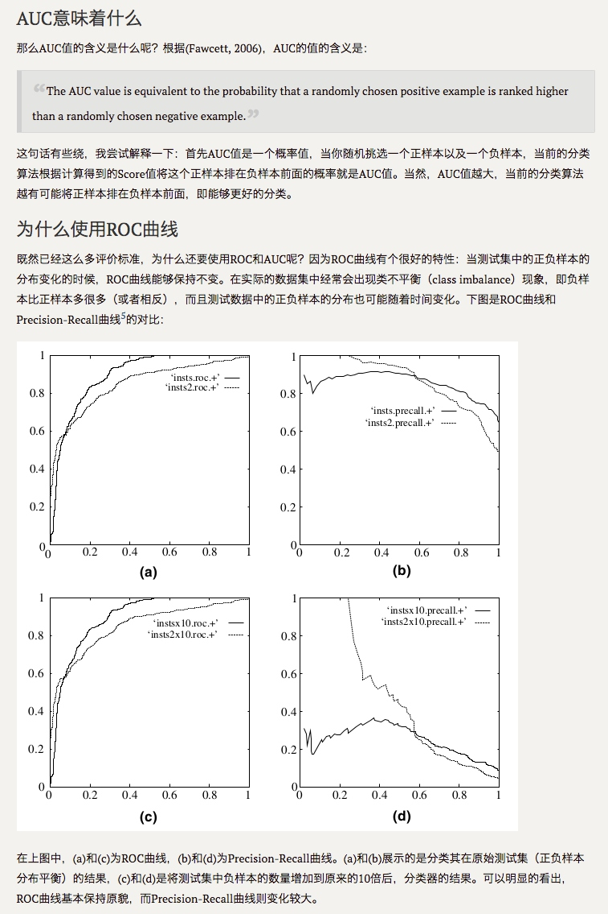

# 召回率、精确率、准确率、F1、ROC曲线、AUC面积、P-R曲线等

## 二分问题的4种结果
TP(True positive) : 真值为正，预测结果也为正（正确预测为正样本）
TN(True Negative) : 真值为负，预测结果也为负（正确预测为负样本）
FP(Fasle Positve) : 真值为负，预测结果为正（错误预测为正样本）
FN(Fasle Negative) : 真值为正，预测为负（错误预测为负样本）

精确率和召回率都是针对关注的类别来说的。
## Recall 召回率
Recall = TP / (TP+FN)
所有正样本中被正确预测为正样本的概率
## Precision 精确率
Precision = TP / (TP+FP)
所有预测为正的样本中多少是真的正样本的概率
## Accuracy 准确率
Accuracy = （TP+TN）/（P+N）
所有样本中被正确预测的，不管正负
## F1值，Precision 和 Recall 的调和平均数
调和平均数（harmonic mean）又称倒数平均数，是总体各统计变量倒数的算术平均数的倒数。
调和平均数，强调了较小值的重要性；在机器学习中。召回率为R, 准确率为P。使用他们对算法的评估，这两个值通常情况下相互制约。为了更加方便的评价算法的好坏。于是引入了F1值。F1为准确率P和召回率R的调和平均数。为什么F1使用调和平均数，而不是数字平均数。
举个例子：当R 接近于1, P 接近于 0 时。采用调和平均数的F1值接近于0；而如果采用算数平均数F1的值为0.5；显然采用调和平均数能更好的评估算法的性能。等效于评价R和P的整体效果
F1= 2 /（1/P+1/R）
## ROC 曲线和 AUC 值
[ROC和AUC介绍以及如何计算AUC](http://alexkong.net/2013/06/introduction-to-auc-and-roc/)
###  ROC曲线
算法中计算时：输入的是 y_pred_proba 和 y_label，概率和0，1。对比时把概率转化成0，1需要一个阀值。所以可以根据阀值画出ROC曲线。
横坐标是：FP/ （FP + TN） 假阳率
纵坐标是：TP /（TP + FN） 真阳率 
怎么画出来的：调节概率区分阀值
### AUC
AUC 值 是 ROC 曲线下的面积。
意义是：随机给分类器一个正样本和一个负样本，该分类器输出该正样本为正的概率值 比 分类器输出该负样本为正的概率值 大的概率。
#### AUC值评估
AUC = 0.5 ，预测效果跟随机猜测差不多
0.5 < AUC < 0.75 , 预测效果一般 
0.75 < AUC < 1 , 预测效果良好，可以投入生产环境
AUC < 0.5 ,  将预测结果取反就行了。
### 优点
不受数据均衡与否的影响，能很好的评估模型的好坏。 
当测试集中正负样本分布发生变化时，ROC曲线能够保持不变。
## ROC曲线和P-R曲线
[ROC曲线和PR(Precision-Recall)曲线的联系](http://www.fullstackdevel.com/computer-tec/data-mining-machine-learning/501.html)
ROC 越左上越好，P-R 越右上越好。

# 过拟合和欠拟合的判断和处理
