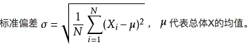
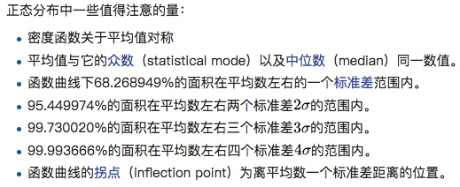

## 调和平均数
## 算术平方根
任意非负实数都有一非负的平方根，称为算术平方根。算术平方根指非负的那个平方根
## 方差（用来描述离散程度）
## 标准差
标准差是方差的算数平方根

## 协方差
## 泰勒公式

## 贝叶斯定理
[wiki 贝叶斯定理](https://zh.wikipedia.org/wiki/%E8%B4%9D%E5%8F%B6%E6%96%AF%E5%AE%9A%E7%90%86)
### 描述
通常事件A 在事件B （发生）的条件下发生的概率，和事件B 在事件A的条件下发生的概率是不一样的，但是他们之间是有一个确定的关系的，而贝叶斯定理就是用来描述他们之间的关系的。贝叶斯定理的作用在于，可以通过已知的三个概率函数推出第四个。
### 推导

## 贝叶斯概率和频率概率
[贝叶斯概率](https://zh.wikipedia.org/wiki/%E8%B4%9D%E5%8F%B6%E6%96%AF%E6%A6%82%E7%8E%87)
## 极大似然估计

## 先验概率、后验概率
## 正态分布
[正态分布](https://zh.wikipedia.org/wiki/%E6%AD%A3%E6%80%81%E5%88%86%E5%B8%83)
正态分布，又名高斯分布，常态分布，是一个自然界和社会常见的一种规律，概率密度函数是一个钟形曲线。

