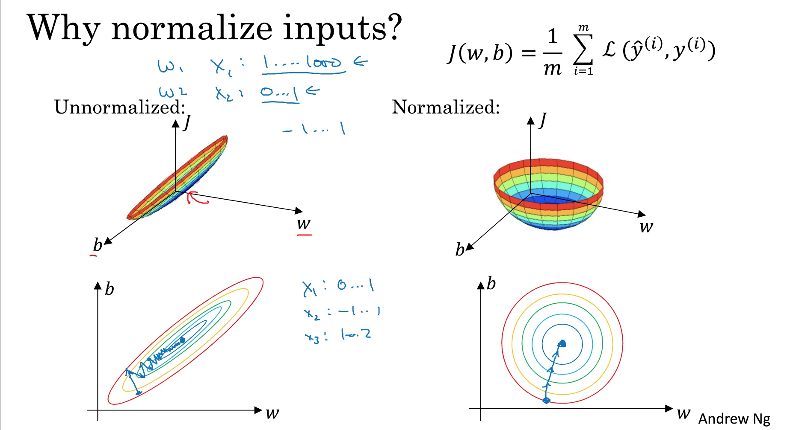

# 过拟合、欠拟合的判断
# 过拟合、欠拟合的解决
[欠拟合、过拟合及其解决方法](https://blog.csdn.net/willduan1/article/details/53070777)
## 过拟合的处理
    1. 正则化
    2. 减少特征
    3. 增加样本数量，对过拟合有用，对欠拟合没用
## 欠拟合的处理
    1. 增加特征

## 为什么要对数据标准化处理（归一化）

可加速收敛，缓解梯度消失或者梯度爆炸问题
## 正则化
正则化是对权重参数的惩罚项，是结构风险最小化的一种策略实现，为了让方差更小，减少过拟合，增强泛化能力。具象上讲，即：让曲线变的平滑。
[机器学习中正则化项L1和L2的直观理解](https://blog.csdn.net/jinping_shi/article/details/52433975)
[L1正则化与L2正则化](https://zhuanlan.zhihu.com/p/35356992)
[机器学习中常常提到的正则化到底是什么意思？](https://www.zhihu.com/question/20924039)
L1正则项，也叫L1范数；L2正则项，也叫L2范数。
L1正则化的模型叫做 Lasso 回归；L2正则化的模型叫做 Ridge 回归（岭回归）。
