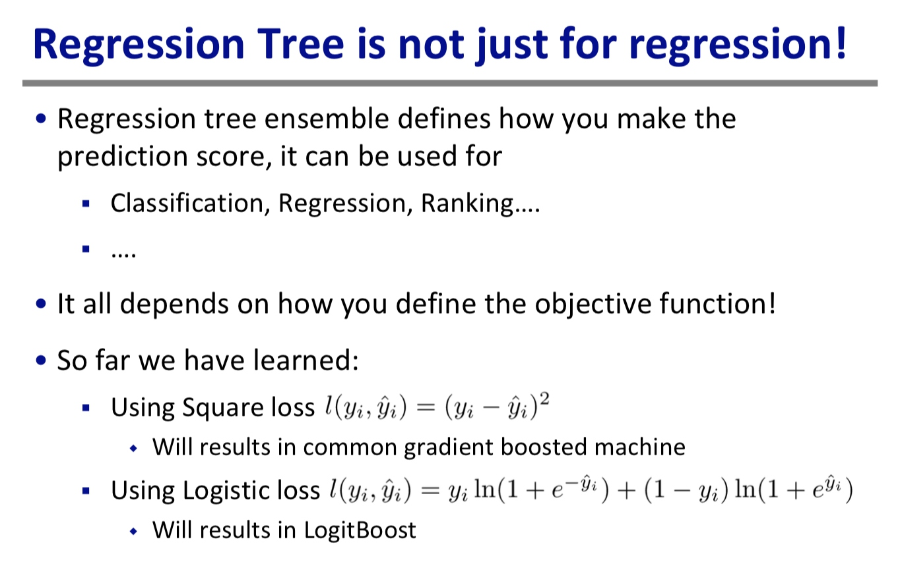
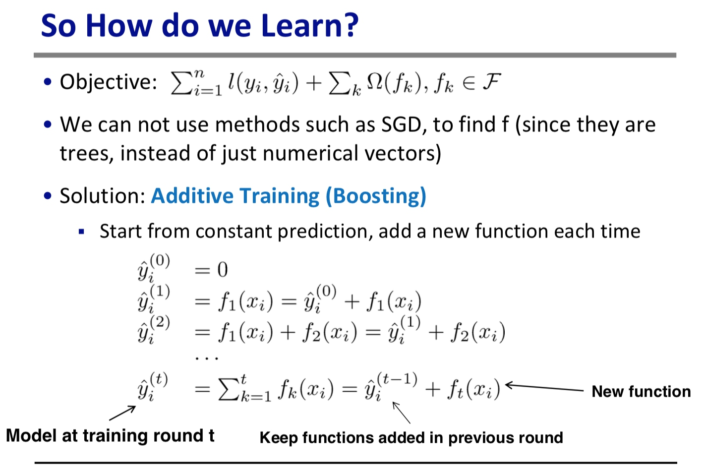
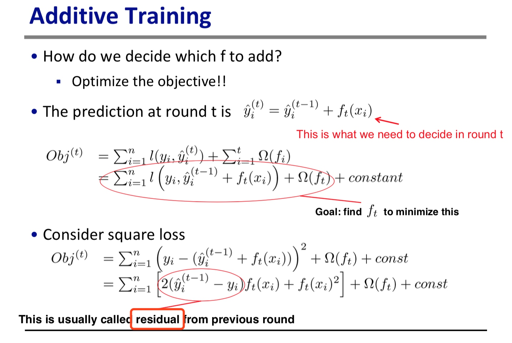
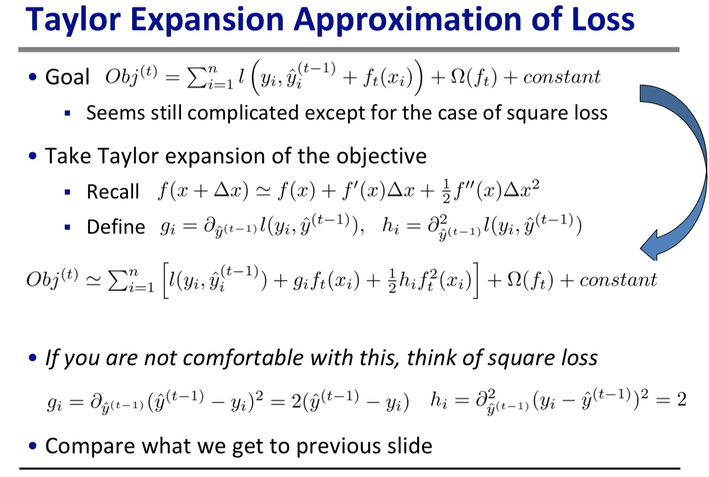
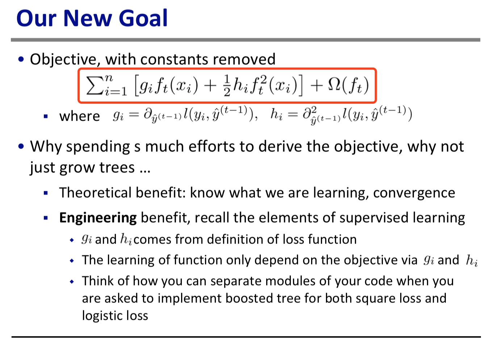
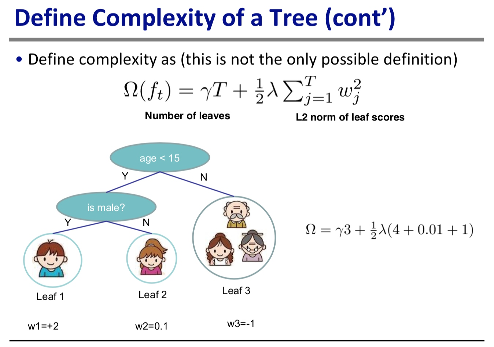

## 陈天奇 PPT
Boosted tree 介绍
### 监督学习一些核心概念
#### 目标函数

正则项用来测量模型复杂度
一些模型目标方程

#### CART

回归树认为是一个属性映射到分数的函数。
这个目标函数由 Loss 项 和 正则项 构成。
K 棵树的集成

如何定义树的复杂度呢？可以用树节点数量、树的深度、叶节点权重的 L2 正则，等。。。
剪枝和正则

回归树不仅只用来回归，也可以用于分类、排序等，只取决于你怎么定义目标函数以及你怎么看待预测分数。

目标函数，不能用SGD，因为这是树模型啊，不是连续的向量，使用的是 boosting 加法模型。

目标函数使用平方误差时的推导，以及定义什么是残差，就是当前值尚与目标值的差距，叫做残差。

对目标函数进行二阶泰勒展开式的近似。

为什么要花这么大力气做泰勒展开？第一 确实化简了式了；最重要第二，是工程优化，提供了一个统一的格式，充分解耦目标函数，只要函数二次可导就可以用来做目标函数，统一了平方误差损失函数和逻辑误差损失函数的形式。

#### 在以上基础上来对 Boosting 改造
定义树的复杂度是：叶节点个数 + 叶节点分数的L2范数。

## GBDT、AdaBoost、XGBoost 对比
基学习器对比
用什么方式防止过拟合的？
    - 损失函数
    - 正则项
    - 剪枝算法
每一个分别的创新和 tricks ？
每一个的优缺点？
相互之间的联系
##
### adaBoost
传统Boosting模型，每次训练会改变样本的权重，使上一次被错分的样本权重变大，得到更大的关注来改善分类性能，最后结果是多次迭代后权重累计的结果
### ？GDBT
与传统 Boosting 模型最大的区别是，每次迭代是为了减少上一次的残差，关键就是利用损失函数的负梯度方向的值作为残差的近似值。与传统的 Boosting 中关注正确错误样本的加权有很大的区别。
GBDT 会累加所有树的结果，这种累加是无法通过分类产生的，所以GDBT的树都是CART回归树，不是分类树。
都是为了减少残差，GBDT 只用了一阶泰勒展开。
优点：比RF基础上又有了进一步提升，能灵活处理各种类型的数据，预测准确度较高
缺点：它是 Boosting ，所以基学习器之间存在串行关系，难以并行训练数据
###？XGBoost
是什么：比 GBDT  又有了进一步提升，性能高，能自动运用CPU的多线程并行运算，精度也有提高
使用了 二阶泰勒展开式，可以自定义损失函数只要有二阶导的。
特点：
1. 传统 GBDT 以 CART 树作为基分类器，XGBoost 还支持线性分类器，这个时候相当于 L1 和 L2 正则化的逻辑回归。
2. 列抽样，借鉴了随机森林，支持列抽样，不仅能防止过拟合，还能减少计算 
3. 缺失值处理，对于缺失值可自动学习出它的分裂方向。
4. 最重要的**支持并行**，如何？树生长的时候需要计算每个特征的增益，事先先把每列数据按排序保存为block结构，计算增益时每个特征的增益可以并行计算。
5. shrikle ？
6. 正则项是 所有叶节点的数量 + 叶节点 score 分数的 L2范数。 

