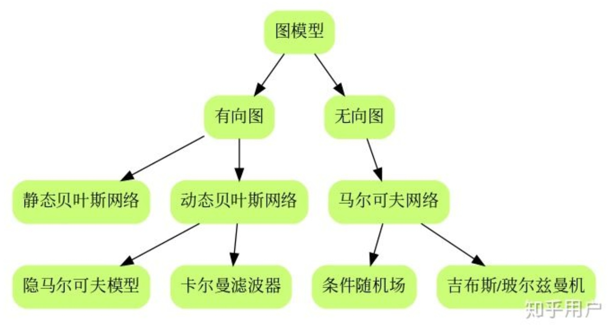
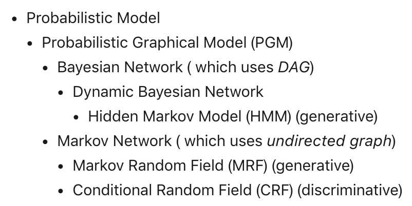
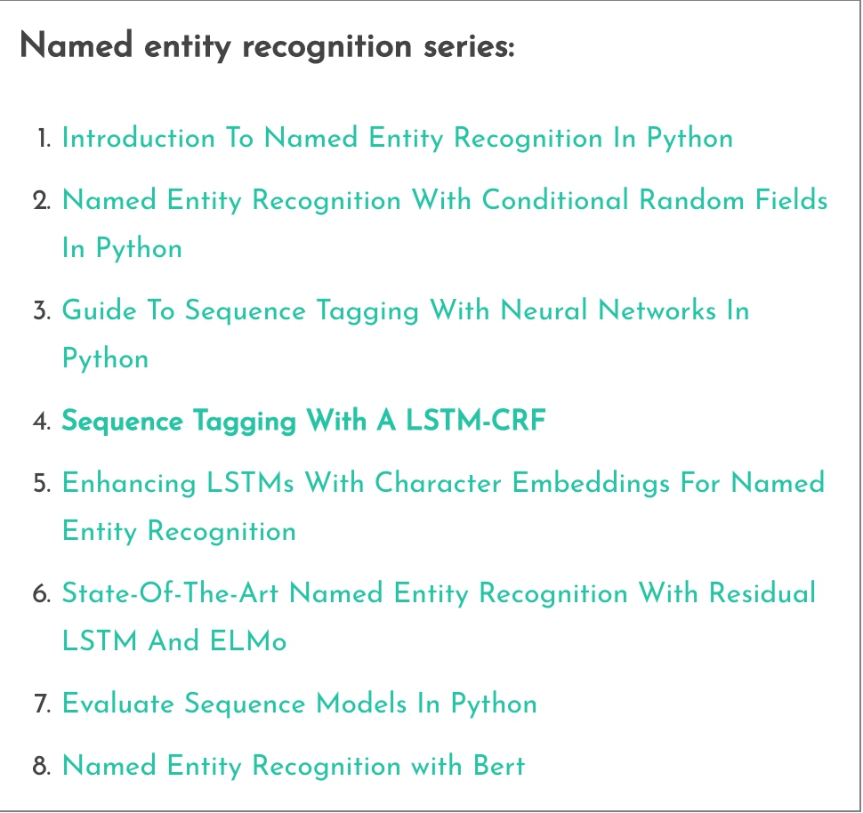

## 怎么学习概率图模型
要是你已经工作了，我觉得还是不要拿宝贵的时间系统学了，从你工作中用到的一个图模型入手，看论文，一点一点走遍图模型，一个模型一个模型地拓扑展开。工作中会用到的模型基本上都是全息的，比如你学个条件随机场，你就得跟隐马对比吧，那你就要分别知道马尔科夫随机场跟贝叶斯网络，然后你就会想知道马尔科夫随机场（条件随机场）跟贝叶斯网络（隐马）有啥区别。要想知道区别在哪你就得知道贝叶斯网络独立性怎么判断、马尔科夫随机场独立性怎么判断、贝叶斯怎么inference、马尔科夫怎么inference、贝叶斯怎么优化、马尔科夫怎么优化，要知道贝叶斯怎么优化你还得知道EM，而EM书上一般都是从最大熵讲的。。。然后你就知道这些都是啥东西了，他们之间是什么关系，这样你就知道概率图模型里都有些啥了，心里就有个谱。我也在用这种方式学，我觉得这个思路比无中生有开始讲要流畅得多。                                                                                                            -- 知乎

## 概率图模型
[读懂概率图：你需要从基本概念和参数估计开始](https://www.jiqizhixin.com/articles/2017-11-29-3)
[概率图模型（PGM）有必要系统地学习一下吗？](https://www.zhihu.com/question/23255632)

## NER 相关参考资料
### 综述
[命名实体识别研究进展综述](http://manu44.magtech.com.cn/Jwk_infotech_wk3/article/2010/1003-3513/1003-3513-26-6-42.html)
### 系列
[用双向lstm+CRF做命名实体识别(附tensorflow代码)——NER系列（四）](https://www.lookfor404.com/%E7%94%A8%E5%8F%8C%E5%90%91lstmcrf%E5%81%9A%E5%91%BD%E5%90%8D%E5%AE%9E%E4%BD%93%E8%AF%86%E5%88%AB%E9%99%84tensorflow%E4%BB%A3%E7%A0%81-ner%E7%B3%BB%E5%88%97%EF%BC%88%E5%9B%9B/#comments)
[Sequence Tagging With A LSTM-CRF](https://www.depends-on-the-definition.com/sequence-tagging-lstm-crf/)

### HMM 、CRF、Viterbi
[隐马尔可夫(HMM)、前/后向算法、Viterbi算法 再次总结](https://blog.csdn.net/xueyingxue001/article/details/52396494)
### BiLSTM + CRF
[DL4NLP —— 序列标注：BiLSTM-CRF模型做基于字的中文命名实体识别](https://www.cnblogs.com/Determined22/p/7238342.html)
[机器之心--一文详解深度学习在命名实体识别(NER)中的应用](https://www.jiqizhixin.com/articles/2018-08-31-2)
[基于keras的BiLstm与CRF实现命名实体标注](http://www.cnblogs.com/vipyoumay/p/ner-chinese-keras.html)
[命名实体识别从数据集到算法实现](https://yq.aliyun.com/articles/604048)
[最通俗易懂的BiLSTM-CRF模型中的CRF层介绍](https://zhuanlan.zhihu.com/p/44042528)

### 英文文章
[Sequence Tagging with Tensorflow bi-LSTM + CRF with character embeddings for NER and POS](https://guillaumegenthial.github.io/sequence-tagging-with-tensorflow.html)
[CRF Layer on the Top of BiLSTM - 1](https://createmomo.github.io/2017/09/12/CRF_Layer_on_the_Top_of_BiLSTM_1/)
### 代码实现
[keras 中 crf 层实现](https://github.com/keras-team/keras-contrib/blob/master/keras_contrib/layers/crf.py)
[lstm-crf](https://github.com/apache/incubator-mxnet/blob/master/example/gluon/lstm_crf/lstm_crf.py)
[NER_BiLSTM_CRF_Chinese](https://github.com/fierceX/NER_BiLSTM_CRF_Chinese/blob/master/model.py)
[ChineseNER](https://github.com/buppt/ChineseNER/blob/master/tensorflow/bilstm_crf.py)
[BiLSTM-CRF 模型实现中文命名实体识别](https://blog.csdn.net/liangjiubujiu/article/details/79674606)
[sequence_tagging](https://github.com/guillaumegenthial/sequence_tagging)
[tf_ner](https://github.com/guillaumegenthial/tf_ner)

## LDA 主题模型<?>

