## 支持向量机
基本模型定义为特征空间上的间隔最大的线性分类器，其学习策略便是间隔最大化，最终可转化为一个凸二次规划问题的求解。
局限性：
在非线性数据量不是特别大的情况下可以试试，还是因为核函数映射到高维空间的问题。大数据量的情况下还是用神经网络吧。
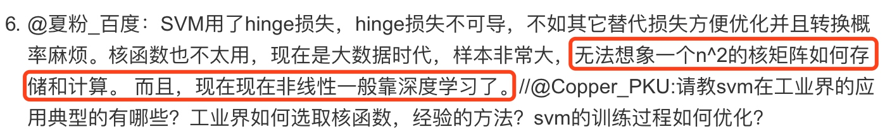
### 线性可分
与线性分类器对比。
与感知机对比，感知机只找到一个分割超平面，上为 +1，下为 -1，但是感知机不保证是最优解。支持向量机则利用间隔最大化策略保证唯一最优分割超平面解。
与逻辑回归对比，逻辑回归在感知机上加了 Sigmoid 激活函数，映射成了0-1的值，可以认为是概率值。支持向量机在其上将 0-1 先转为 二分类的 -1 +1。
间隔函数：
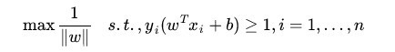
最大化间隔函数：间隔是图中 Gap 的一半。
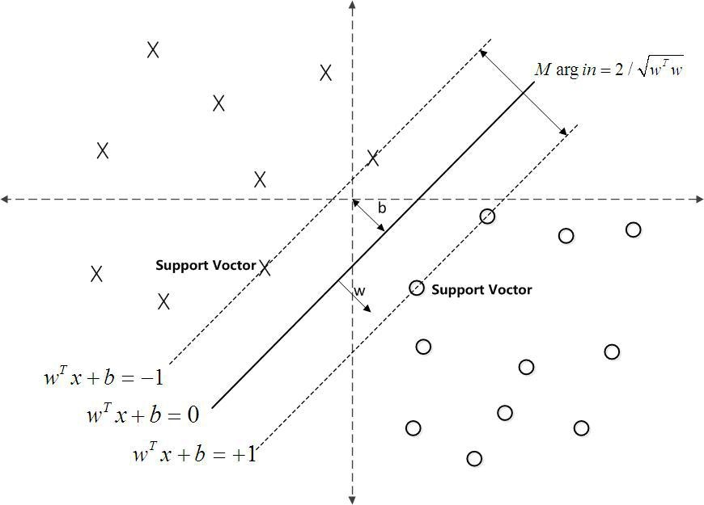
### 从原始问题到对偶问题的转换
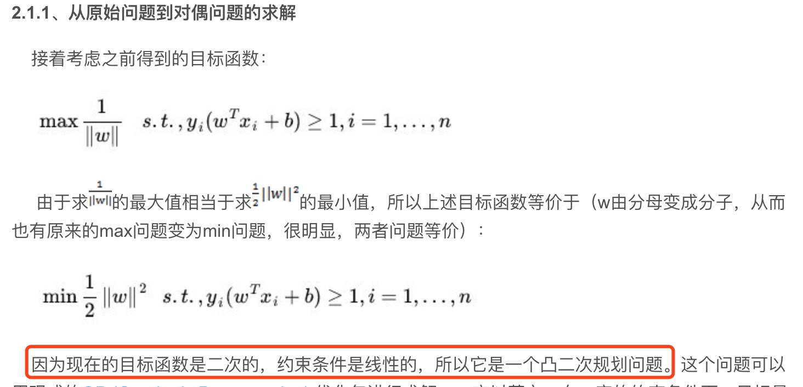
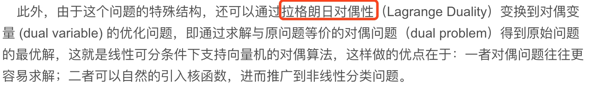
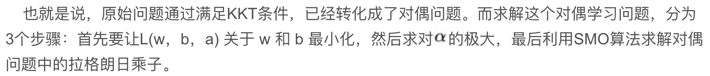
### 线性不可分
核函数 Kernel 将线性分类推广到非线性分类问题。
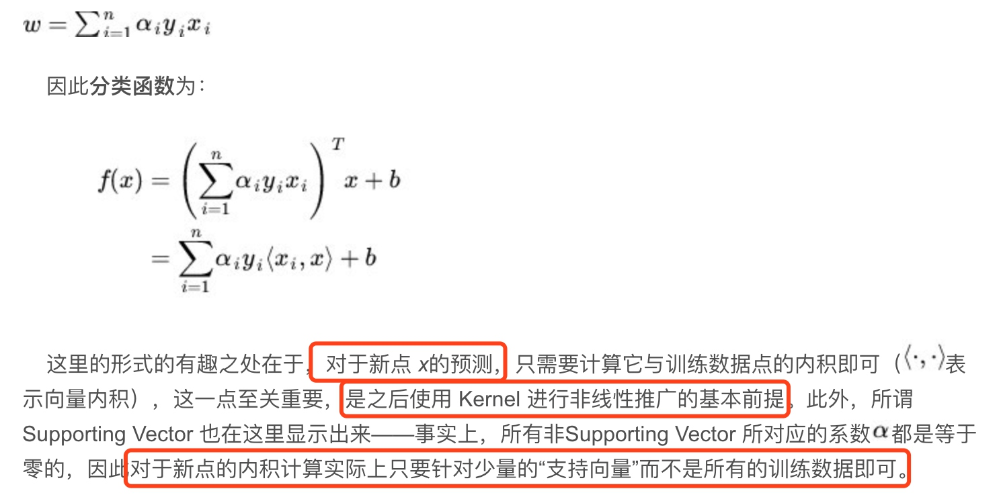
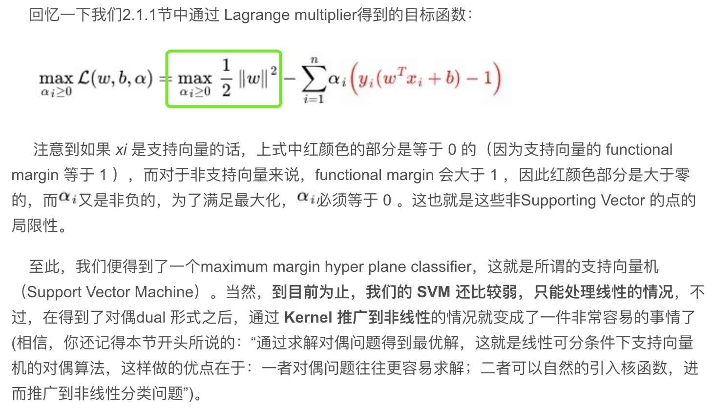
### 核函数 Kernel 
特征空间的隐式映射：核函数
对于非线性的情况，SVM 的处理方法是选择一个核函数 κ(⋅,⋅) ，通过将数据映射到高维空间，来解决在原始空间中线性不可分的问题。
具体来说，在线性不可分的情况下，支持向量机首先在低维空间中完成计算，然后通过核函数将输入空间映射到高维特征空间，最终在高维特征空间中构造出最优分离超平面，从而把平面上本身不好分的非线性数据分开。如图所示，一堆数据在二维空间无法划分，从而映射到三维空间里划分：
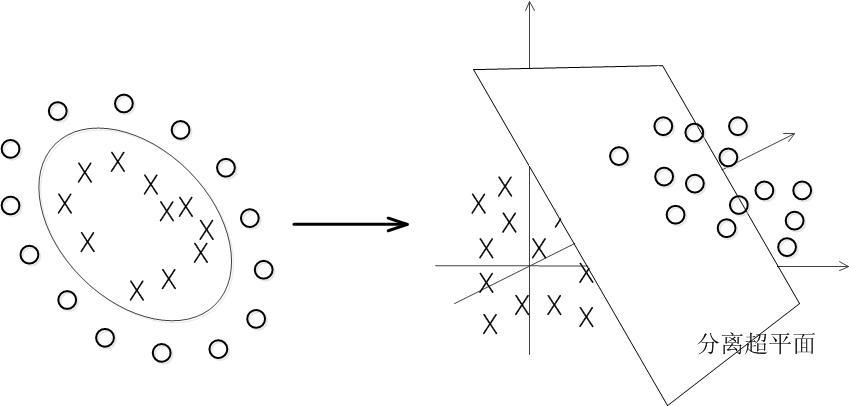
等价于应用一个固定的非线性映射，将数据映射到特征空间，在特征空间中使用线性学习器。
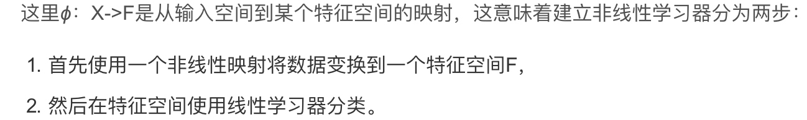

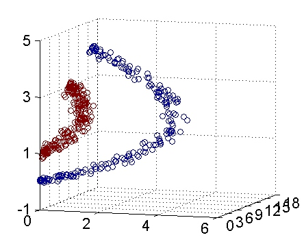
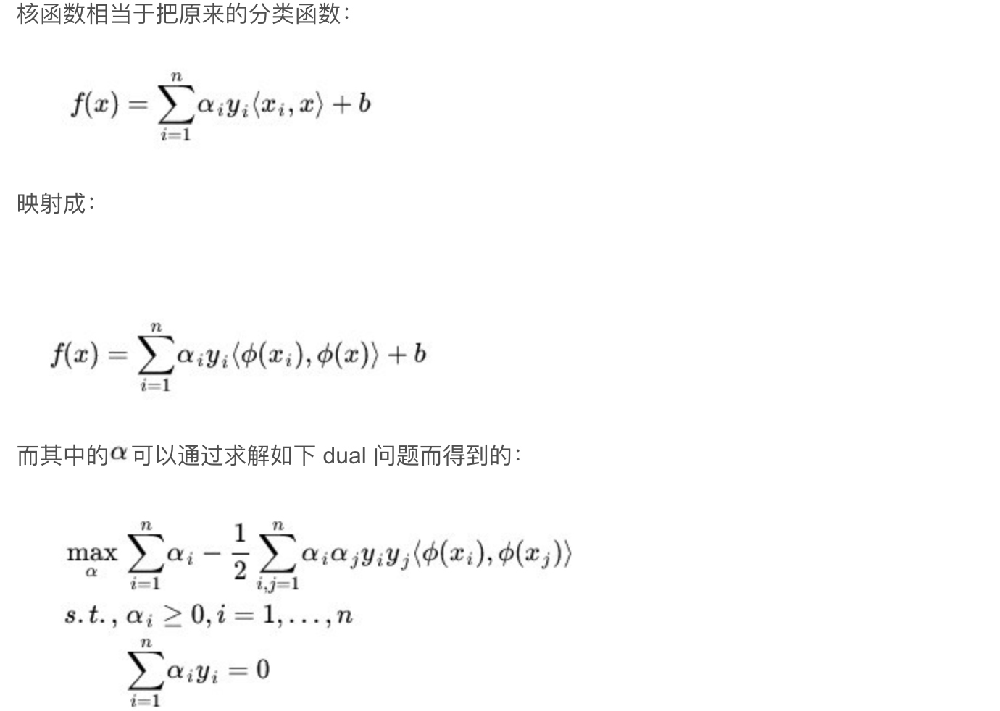
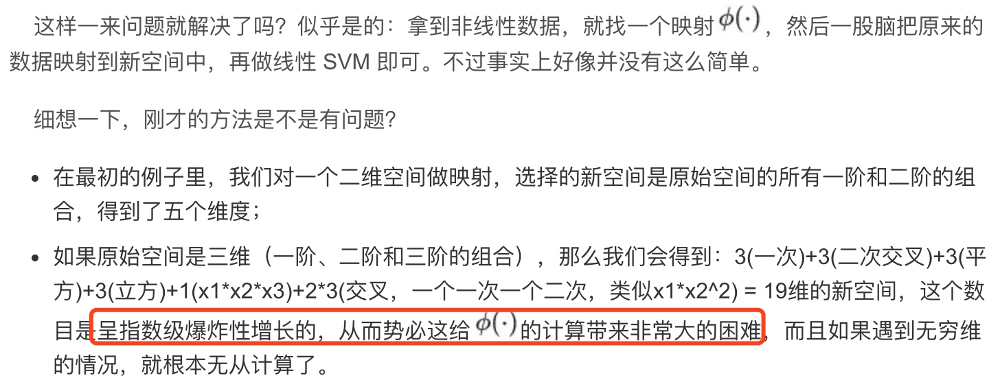
Kernel 为了解决纬度映射时的纬度爆炸💥问题。
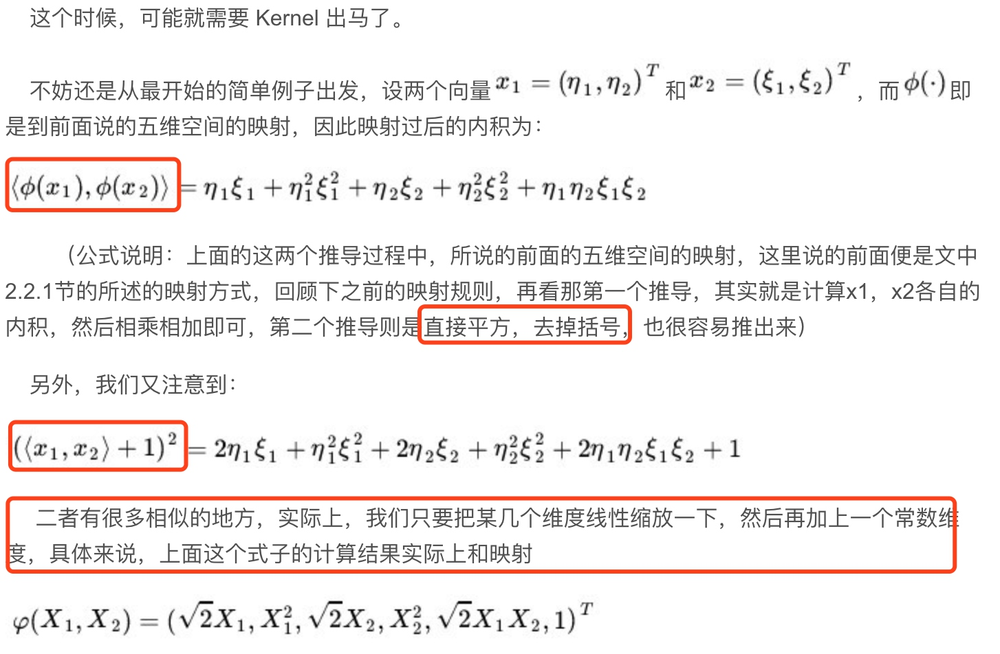
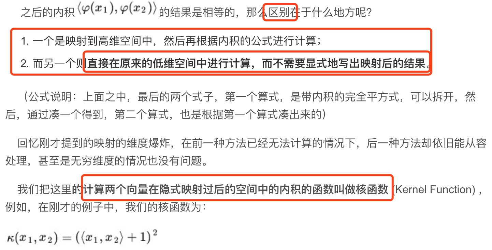
核函数可以用来简化映射空间的内积运算。解决了计算问题，避免了直接在高维空间进行计算，不是什么高级东西，只是一种计算技巧而已。
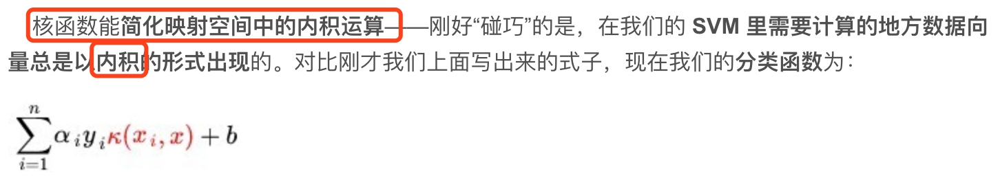
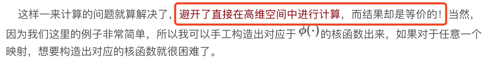
几个核函数：
多项式核心函数、高斯核函数、线性核。常用高斯核函数。
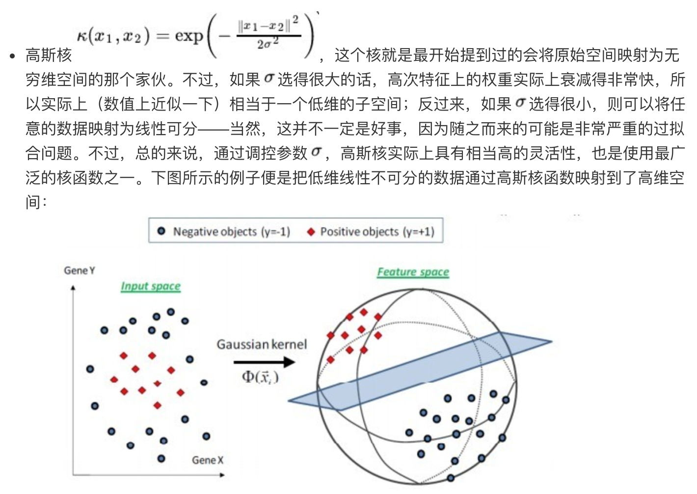
核函数相当于数据的映射方式，通过调节参数调节核函数，可以决定数据映射的纬度，一定可以保证线性可分。
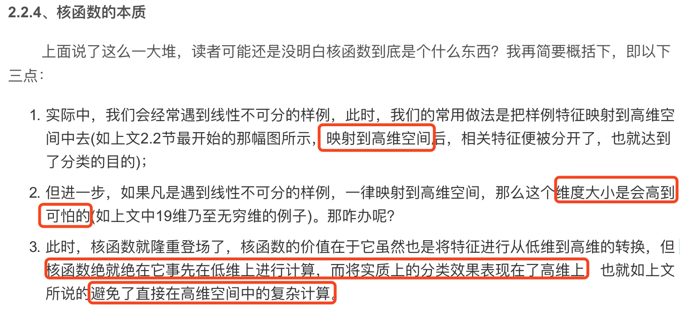
### 软间隔 
虽然通过映射将原始数据映射到高维空间之后，能够线性分隔的概率大大增加，但是对于某些情况还是很难处理。
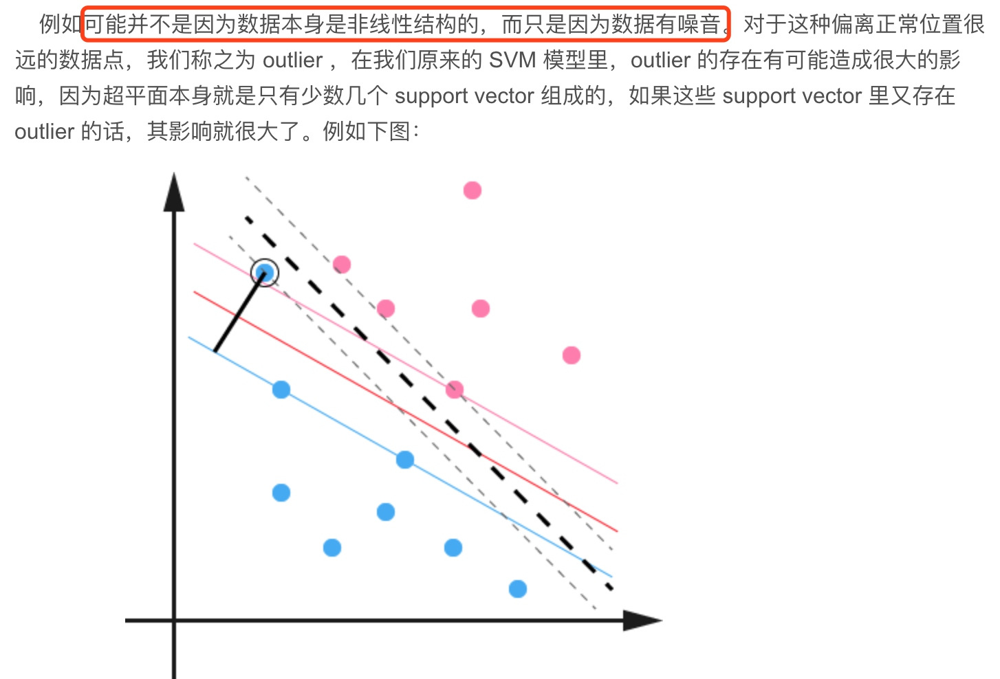
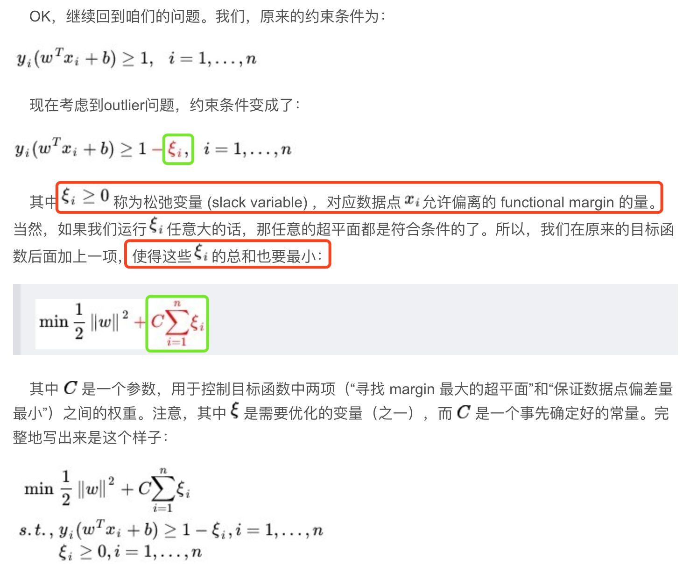
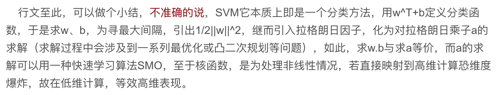
### SMO 算法用于快速求解对偶问题