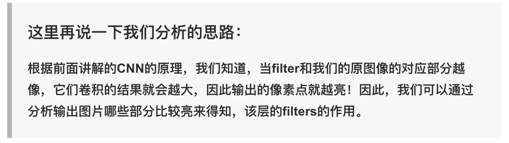

# 参考资料
[【DL笔记6】从此明白了卷积神经网络（CNN）](https://www.jianshu.com/p/c0215d26d20a)
[【DL笔记8】如果你愿意一层一层剥开CNN的心——你会明白它究竟在做什么](https://www.jianshu.com/p/09f35a390ac2)

[全面了解卷积神经网络](https://zhuanlan.zhihu.com/p/33404955)
[卷积：如何成为一个很厉害的神经网络](https://jizhi.im/blog/post/intuitive_explanation_cnn?utm_source=wechat_session&utm_medium=social&utm_oi=68927006703616&from=singlemessage)
[如何通俗易懂地解释卷积？](https://www.zhihu.com/question/22298352)
[卷积为什么叫「卷」积？](https://www.zhihu.com/question/54677157/answer/141245297)
知乎搜索《卷积》、《卷积的物理意义》、《如何通俗易懂地解释卷积？》
B站 3BlueBrown

# 问题
写的超级好，写的思路跟我想了解的一样，写的超级棒超级清晰。
[【DL笔记6】从此明白了卷积神经网络（CNN）](https://www.jianshu.com/p/c0215d26d20a)

卷积为什么叫「卷」积？
为什么要用卷积，有啥好处(减少参数)
卷积概念，卷积为什么会起作用
核心结构层构成
- 卷积层+ReLu
- 池化层pooling
- 全连接层FC
每层原理和作用
每层输入输出和核心参数
卷积网络的实现
- 常见结构（letnet）
卷积网络的调参

## 核心结构层构成
* 卷积层+ReLu
* 池化层pooling（max、Average、sum、k-max pooling）
* 全连接层FC（Fully Connected Layer）
卷积层 和 池化层 负责 特征采集，全连接层负责 分类
### 卷积层+ReLu
多个 kernel 移动遍历，就生成了源数据的多个 “分身” 表示。
构成：卷积核 kernel（又叫：滤波器等）
核心参数：kernel 大小、padding（same、Valid）、stride、channel (比如彩色图像一般有RGB三个channel )

### 池化层
好处：
1. 降维、
2. 例如图像处理可以忽略掉图像缩放，统一特征
争议：
池化会忽略掉很多信息，所以池化层有争议

#问题 
## 卷积为什么可以提取特征
[【DL笔记8】如果你愿意一层一层剥开CNN的心——你会明白它究竟在做什么](https://www.jianshu.com/p/09f35a390ac2)

