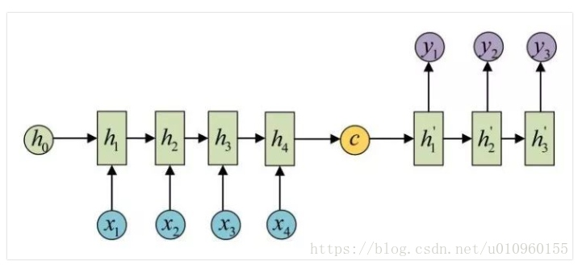
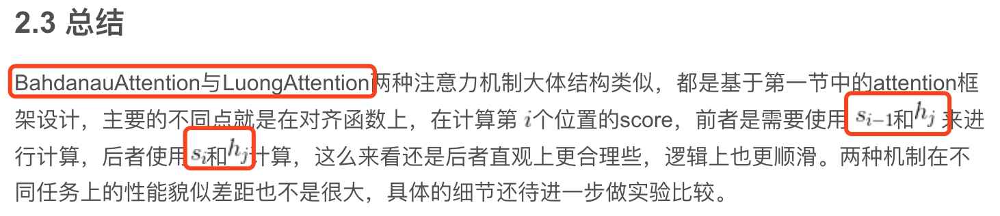

注意力机制 - 手术刀
## 通俗理解
<1>
Seq2Seq 模型，一般用双向 LSTM Encode，用 一个 RNN 解码 Decode，RNN 解码时，每一个 word 生成时，取决于 前一个生成的字的隐藏层输出，和 序列因素加权和的输出。由于是 RNN 解码，只到碰见<EOS> 停止解码。 （看吴恩达 deeplearning.ai ）
<2>
简单来说，注意力本质上就是一个经过softmax层输出的向量。
<3>
在早期机器翻译应用中，神经网络结构一般如下图，是一个RNN的Encoder-Decoder模型。左边是Encoder，代表输入的sentence。右边代表Decoder，是根据输入sentence对应的翻译。Encoder会通过RNN将最后一个step的隐藏状态向量c作为输出，Deocder利用向量c进行翻译。这样做有一个缺点，翻译时过分依赖于这个将整个sentence压缩成固定输入的向量。输入的sentence有可能包含上百个单词，这么做不可避免会造成信息的丢失，翻译结果也无法准确了。

注意力机制的引入就是为了解决此问题，注意力机制使得机器翻译中利用原始的sentence信息，减少信息损失。在解码层，生成每个时刻的y，都会利用到x1,x2,x3....，而不再仅仅利用最后时刻的隐藏状态向量。同时注意力机制还能使翻译器zoom in or out（使用局部或全局信息）。
<4> 张俊林
[深度学习中的注意力机制](https://blog.csdn.net/qq_40027052/article/details/78421155)
要了解深度学习中的注意力模型，就不得不先谈Encoder-Decoder框架，因为目前大多数注意力模型附着在Encoder-Decoder框架下，当然，其实注意力模型可以看作一种通用的思想，本身并不依赖于特定框架，这点需要注意。
## 我还不懂的问题
### 注意力机制分类
<1> BahdanauAttention与LuongAttention
[BahdanauAttention与LuongAttention注意力机制简介](https://blog.csdn.net/u010960155/article/details/82853632)

### 自注意力机制跟普通注意力机制有啥区别
### 注意力机制 score 怎么计算？
### Seq2Seq模型 和 注意力机制 如何训练学习和预测？
### <EOS> 怎么停止 RNN 解码？
### Transformer 结构原理
### Bert 原理 