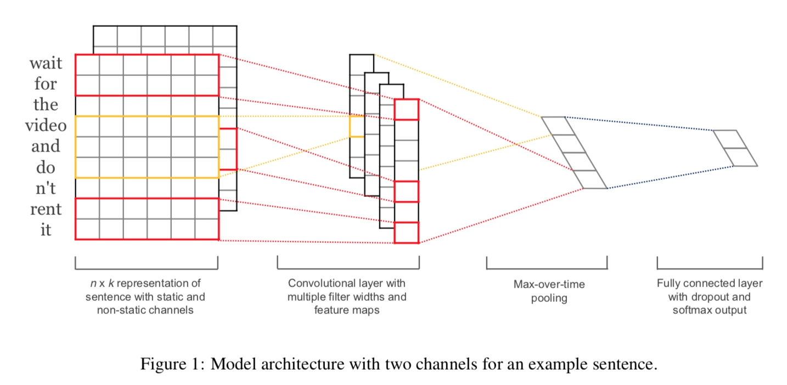

## TextCNN
论文：Convolutional Neural Networks for Sentence Classification

一维卷积、一维pooling
一维卷积的意思是指，卷积核只在一个方向移动。
卷积核的纬度是 h*k，h 代表词窗口宽度，k是词向量纬度。通过不同词宽度和不同参数的卷积核来提取特征。
不同卷积核提取后的数据纬度如下：
要仔细看这里，这里举例用了两个不同宽度的词窗口，一个2一个3，每个相同宽度的词窗口又用了两个不同的channel，所以总共是4个卷积核去做卷积。得到了4个feature map。两个 6x1，两个 7x1, 然后使用 max-overtime-pooling 对得到的feature-map做一次整体 max-pooling，这样就能处理不同长度的句子了，pooling 结果拼接，再接带 dropout 的全联接层，然后接 softmax output。
###思考
1. 如何处理文章分类？
论文名是 CNN for 句子分类，通过模型结构也能发现，pooling 的时候会损失信息，越长的句子损失越多，其实是不适合太长文本的分类的，我觉得。所以论文名字要叫 CNN for sentence。如果要做文章分类，我觉得可以将文章中每个句子得到的 pooling 向量 concat 拼接起来，作为文章特征。
