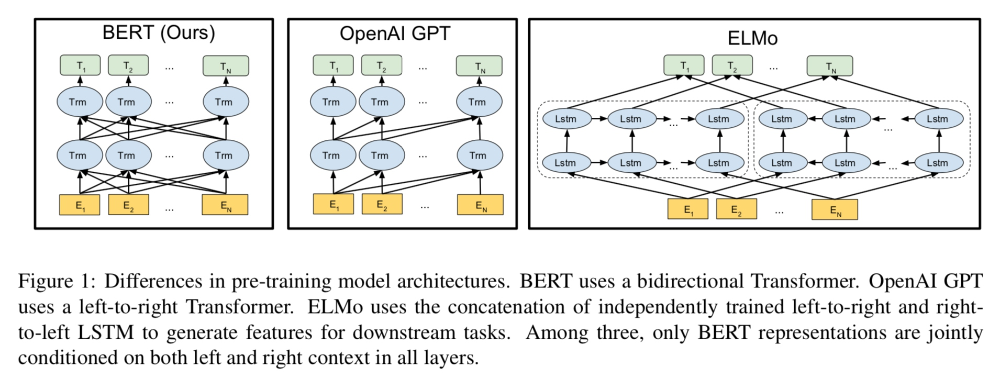

## BERT 
Bidirectional Encoder Representations from Transformers
使用 Transformer 的双向编码表示。
### 论文摘要
1. 回顾了通用语言表示的长历史，三种：
    基于特征表示的，最新是 ELMo；
    基于 迁移学习微调 模型的，OPENAI GPT
    基于无监督数据迁移学习的。
2. 利用无监督数据预训练，取之不尽，用之不竭。
### Bert、OpenAI GPT、ELMo 对比

Bert 使用了双向 Transformer，OpenAI GPT 使用了从左到右的单向 Trm，ELMo 使用了两个独立的左到右、右到左 的LSTM 来提取特征给下游任务使用。
只有 Bert 在所有层的表示 同时使用了 左和右 的上下文信息。
